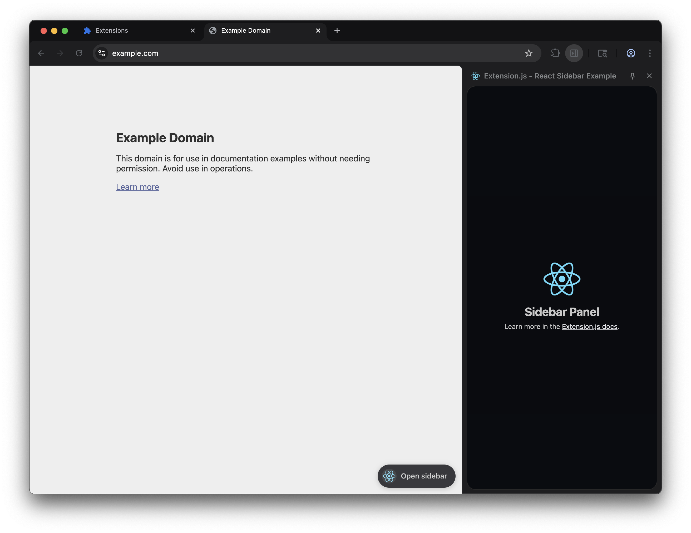
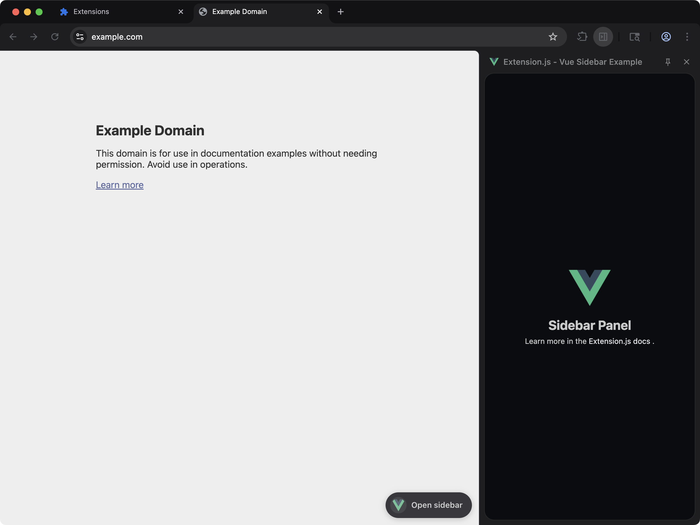

[powered-image]: https://img.shields.io/badge/Powered%20by-Extension.js-0971fe?logo=extension.js&logoColor=white&style=flat
[powered-url]: https://extension.js.org
[action-image]: https://img.shields.io/github/actions/workflow/status/extension-js/examples/ci.yml?branch=main&label=CI&logo=github&color=2ecc40&style=flat
[action-url]: https://github.com/extension-js/examples/actions
[chromium-image]: https://img.shields.io/badge/Chromium-Compatible-4285F4?logo=googlechrome&logoColor=white&style=flat
[chromium-url]: https://www.chromium.org
[firefox-image]: https://img.shields.io/badge/Firefox-Compatible-FF7139?logo=firefox-browser&logoColor=white&style=flat
[firefox-url]: https://www.mozilla.org/firefox/
[discord-image]: https://img.shields.io/discord/1253608412890271755?label=Discord&logo=discord&style=flat&color=2ecc40
[discord-url]: https://discord.gg/v9h2RgeTSN

[![Powered by Extension.js][powered-image]][powered-url] [![CI][action-image]][action-url] [![chromium][chromium-image]][chromium-url] [![firefox][firefox-image]][firefox-url] [![discord][discord-image]][discord-url]

# Extension.js Examples

> A collection of browser extension examples

This repository contains browser extension examples built with Extension.js. Each example demonstrates different patterns, frameworks, and use cases for building cross-browser extensions.

  
 JavaScript Sidebar Example

  <table>
    <tr>
      <td>Repository</td>
      <td align="right"><a href="https://github.com/extension-js/examples/blob/main/examples/javascript/README.md">examples/javascript</a></td>
      <td rowspan="5"></td>
    </tr>
    <tr><td>Version</td><td align="right">1.0.0</td></tr>
    <tr><td>Context</td><td align="right">Sidebar, Content Script, Action</td></tr>
    <tr><td>JavaScript framework</td><td align="right">JavaScript</td></tr>
    <tr><td>CSS</td><td align="right">Standard CSS</td></tr>
    <tr>
      <td>Background included</td>
      <td align="right">Yes</td>
      <td align="center"><a href="https://templates.extension.dev/javascript">Start with this template &#8599;</a></td>
    </tr>
  </table>

  
 React Sidebar Example

  <table>
    <tr>
      <td>Repository</td>
      <td align="right"><a href="https://github.com/extension-js/examples/blob/main/examples/react/README.md">examples/react</a></td>
      <td rowspan="5"></td>
    </tr>
    <tr><td>Version</td><td align="right">1.0.0</td></tr>
    <tr><td>Context</td><td align="right">Sidebar, Content Script, Action</td></tr>
    <tr><td>JavaScript framework</td><td align="right">React</td></tr>
    <tr><td>CSS</td><td align="right">Standard CSS</td></tr>
    <tr>
      <td>Background included</td>
      <td align="right">Yes</td>
      <td align="center"><a href="https://templates.extension.dev/react">Start with this template &#8599;</a></td>
    </tr>
  </table>

  
 Preact Sidebar Example

  <table>
    <tr>
      <td>Repository</td>
      <td align="right"><a href="https://github.com/extension-js/examples/blob/main/examples/preact/README.md">examples/preact</a></td>
      <td rowspan="5"></td>
    </tr>
    <tr><td>Version</td><td align="right">1.0.0</td></tr>
    <tr><td>Context</td><td align="right">Sidebar, Content Script, Action</td></tr>
    <tr><td>JavaScript framework</td><td align="right">Preact</td></tr>
    <tr><td>CSS</td><td align="right">Standard CSS</td></tr>
    <tr>
      <td>Background included</td>
      <td align="right">Yes</td>
      <td align="center"><a href="https://templates.extension.dev/preact">Start with this template &#8599;</a></td>
    </tr>
  </table>

  
 Svelte Sidebar Example

  <table>
    <tr>
      <td>Repository</td>
      <td align="right"><a href="https://github.com/extension-js/examples/blob/main/examples/svelte/README.md">examples/svelte</a></td>
      <td rowspan="5"></td>
    </tr>
    <tr><td>Version</td><td align="right">1.0.0</td></tr>
    <tr><td>Context</td><td align="right">Sidebar, Content Script, Action</td></tr>
    <tr><td>JavaScript framework</td><td align="right">Svelte</td></tr>
    <tr><td>CSS</td><td align="right">Standard CSS</td></tr>
    <tr>
      <td>Background included</td>
      <td align="right">Yes</td>
      <td align="center"><a href="https://templates.extension.dev/svelte">Start with this template &#8599;</a></td>
    </tr>
  </table>

  
 Vue Sidebar Example

  <table>
    <tr>
      <td>Repository</td>
      <td align="right"><a href="https://github.com/extension-js/examples/blob/main/examples/vue/README.md">examples/vue</a></td>
      <td rowspan="5"></td>
    </tr>
    <tr><td>Version</td><td align="right">1.0.0</td></tr>
    <tr><td>Context</td><td align="right">Sidebar, Content Script, Action</td></tr>
    <tr><td>JavaScript framework</td><td align="right">Vue</td></tr>
    <tr><td>CSS</td><td align="right">Standard CSS</td></tr>
    <tr>
      <td>Background included</td>
      <td align="right">Yes</td>
      <td align="center"><a href="https://templates.extension.dev/vue">Start with this template &#8599;</a></td>
    </tr>
  </table>

  
 TypeScript Sidebar Example

  <table>
    <tr>
      <td>Repository</td>
      <td align="right"><a href="https://github.com/extension-js/examples/blob/main/examples/typescript/README.md">examples/typescript</a></td>
      <td rowspan="5"></td>
    </tr>
    <tr><td>Version</td><td align="right">1.0.0</td></tr>
    <tr><td>Context</td><td align="right">Sidebar, Content Script, Action</td></tr>
    <tr><td>JavaScript framework</td><td align="right">TypeScript</td></tr>
    <tr><td>CSS</td><td align="right">Standard CSS</td></tr>
    <tr>
      <td>Background included</td>
      <td align="right">Yes</td>
      <td align="center"><a href="https://templates.extension.dev/typescript">Start with this template &#8599;</a></td>
    </tr>
  </table>

## License

MIT (c) Cezar Augusto and the Extension.js Authors.
