[powered-image]: https://img.shields.io/badge/Powered%20by-Extension.js-0971fe?logo=extension.js&logoColor=white&style=flat
[powered-url]: https://extension.js.org
[action-image]: https://img.shields.io/github/actions/workflow/status/extension-js/examples/ci.yml?branch=main&label=CI&logo=github&color=2ecc40&style=flat
[action-url]: https://github.com/extension-js/examples/actions
[chromium-image]: https://img.shields.io/badge/Chromium-Compatible-4285F4?logo=googlechrome&logoColor=white&style=flat
[chromium-url]: https://www.chromium.org
[firefox-image]: https://img.shields.io/badge/Firefox-Compatible-FF7139?logo=firefox-browser&logoColor=white&style=flat
[firefox-url]: https://www.mozilla.org/firefox/
[discord-image]: https://img.shields.io/discord/1253608412890271755?label=Discord&logo=discord&style=flat&color=2ecc40
[discord-url]: https://discord.gg/v9h2RgeTSN

[![Powered by Extension.js][powered-image]][powered-url] [![CI][action-image]][action-url] [![chromium][chromium-image]][chromium-url] [![firefox][firefox-image]][firefox-url] [![discord][discord-image]][discord-url]

# Extension.js Examples

> A collection of browser extension examples

This repository contains browser extension examples built with Extension.js. Each example demonstrates different patterns, frameworks, and use cases for building cross-browser extensions.

## Run an example from a clone

The examples ship without npm scripts, so run Extension.js directly from the example directory. Run `npm install` first when the example declares dependencies:

```bash
git clone https://github.com/extension-js/examples.git
cd examples/examples/javascript
npm install
npx extension@latest dev .
```

Prefer a fresh project instead? Every example doubles as a create template:

```bash
npx extension@latest create my-extension --template javascript
```

## Web standards and framework support

<div align="center">

|  |  |  |  |  |  |  |
| :---------------------------------------------------------------------------------------------------------------------: | :---------------------------------------------------------------------------------------------------------------------: | :---------------------------------------------------------------------------------------------------------------------: | :---------------------------------------------------------------------------------------------------------------------: | :---------------------------------------------------------------------------------------------------------------------: | :---------------------------------------------------------------------------------------------------------------------: | :---------------------------------------------------------------------------------------------------------------------: |
|                             ESNext<br>[Try out](https://templates.extension.dev/javascript)                             |                           TypeScript<br>[Try out](https://templates.extension.dev/typescript)                           |                           WASM<br>[Try out](https://templates.extension.dev/transformers-js)                            |                                React<br>[Try out](https://templates.extension.dev/react)                                |                                  Vue<br>[Try out](https://templates.extension.dev/vue)                                  |                               Svelte<br>[Try out](https://templates.extension.dev/svelte)                               |                               Preact<br>[Try out](https://templates.extension.dev/preact)                               |

</div>

## Examples

### Sidebar

<details>
  <summary> JavaScript Example</summary>

> JavaScript-based extension with a sidebar panel. Adds a sidebar with a simple page.

  <table>
    <tr>
      <td>Repository</td>
      <td align="right"><a href="https://github.com/extension-js/examples/blob/main/examples/javascript/README.md">examples/javascript</a></td>
      <td rowspan="5"></td>
    </tr>
    <tr><td>Version</td><td align="right">1.0.0</td></tr>
    <tr><td>Context</td><td align="right">Content Script, Sidebar, Background</td></tr>
    <tr><td>JavaScript framework</td><td align="right">JavaScript</td></tr>
    <tr><td>CSS</td><td align="right">CSS</td></tr>
    <tr>
      <td>Background included</td>
      <td align="right">Yes</td>
      <td align="center"><a href="https://templates.extension.dev/javascript">Start with this template &#8599;</a></td>
    </tr>
  </table>
</details>

<details>
  <summary> React Example</summary>

> React-based extension with a sidebar panel. Adds a sidebar with a simple page.

  <table>
    <tr>
      <td>Repository</td>
      <td align="right"><a href="https://github.com/extension-js/examples/blob/main/examples/react/README.md">examples/react</a></td>
      <td rowspan="5">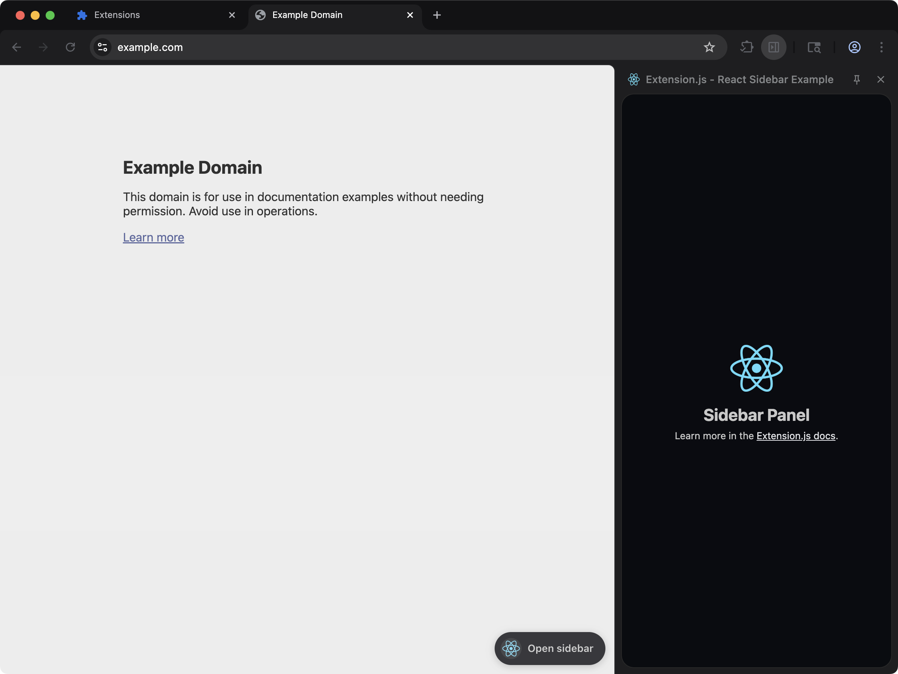</td>
    </tr>
    <tr><td>Version</td><td align="right">1.0.0</td></tr>
    <tr><td>Context</td><td align="right">Content Script, Sidebar, Background</td></tr>
    <tr><td>JavaScript framework</td><td align="right">React</td></tr>
    <tr><td>CSS</td><td align="right">CSS</td></tr>
    <tr>
      <td>Background included</td>
      <td align="right">Yes</td>
      <td align="center"><a href="https://templates.extension.dev/react">Start with this template &#8599;</a></td>
    </tr>
  </table>
</details>

<details>
  <summary> Preact Example</summary>

> Preact-based extension with a sidebar panel. Adds a sidebar with a simple page.

  <table>
    <tr>
      <td>Repository</td>
      <td align="right"><a href="https://github.com/extension-js/examples/blob/main/examples/preact/README.md">examples/preact</a></td>
      <td rowspan="5">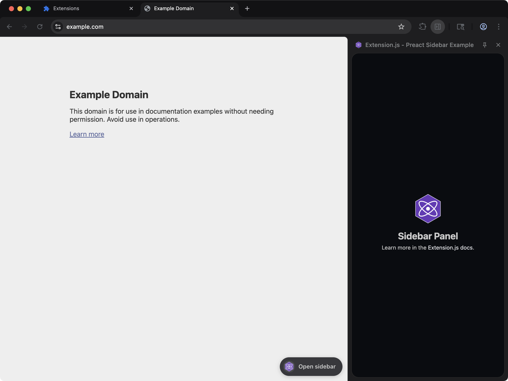</td>
    </tr>
    <tr><td>Version</td><td align="right">1.0.0</td></tr>
    <tr><td>Context</td><td align="right">Content Script, Sidebar, Background</td></tr>
    <tr><td>JavaScript framework</td><td align="right">Preact</td></tr>
    <tr><td>CSS</td><td align="right">CSS</td></tr>
    <tr>
      <td>Background included</td>
      <td align="right">Yes</td>
      <td align="center"><a href="https://templates.extension.dev/preact">Start with this template &#8599;</a></td>
    </tr>
  </table>
</details>

<details>
  <summary> Svelte Example</summary>

> Svelte-based extension with a sidebar panel. Adds a sidebar with a simple page.

  <table>
    <tr>
      <td>Repository</td>
      <td align="right"><a href="https://github.com/extension-js/examples/blob/main/examples/svelte/README.md">examples/svelte</a></td>
      <td rowspan="5"></td>
    </tr>
    <tr><td>Version</td><td align="right">1.0.0</td></tr>
    <tr><td>Context</td><td align="right">Content Script, Sidebar, Background</td></tr>
    <tr><td>JavaScript framework</td><td align="right">Svelte</td></tr>
    <tr><td>CSS</td><td align="right">CSS</td></tr>
    <tr>
      <td>Background included</td>
      <td align="right">Yes</td>
      <td align="center"><a href="https://templates.extension.dev/svelte">Start with this template &#8599;</a></td>
    </tr>
  </table>
</details>

<details>
  <summary> Vue Example</summary>

> Vue.js-based extension with a sidebar panel. Adds a sidebar with a simple page.

  <table>
    <tr>
      <td>Repository</td>
      <td align="right"><a href="https://github.com/extension-js/examples/blob/main/examples/vue/README.md">examples/vue</a></td>
      <td rowspan="5">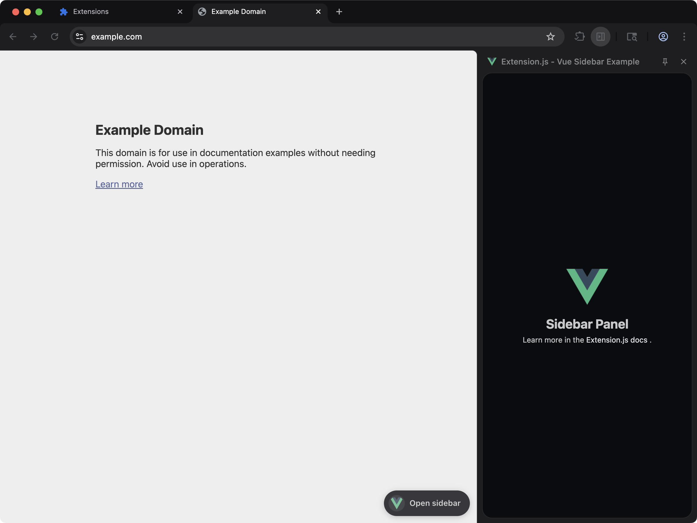</td>
    </tr>
    <tr><td>Version</td><td align="right">1.0.0</td></tr>
    <tr><td>Context</td><td align="right">Content Script, Sidebar, Background</td></tr>
    <tr><td>JavaScript framework</td><td align="right">Vue</td></tr>
    <tr><td>CSS</td><td align="right">CSS</td></tr>
    <tr>
      <td>Background included</td>
      <td align="right">Yes</td>
      <td align="center"><a href="https://templates.extension.dev/vue">Start with this template &#8599;</a></td>
    </tr>
  </table>
</details>

<details>
  <summary> TypeScript Example</summary>

> TypeScript-based extension with a sidebar panel. Adds a sidebar with a simple page.

  <table>
    <tr>
      <td>Repository</td>
      <td align="right"><a href="https://github.com/extension-js/examples/blob/main/examples/typescript/README.md">examples/typescript</a></td>
      <td rowspan="5">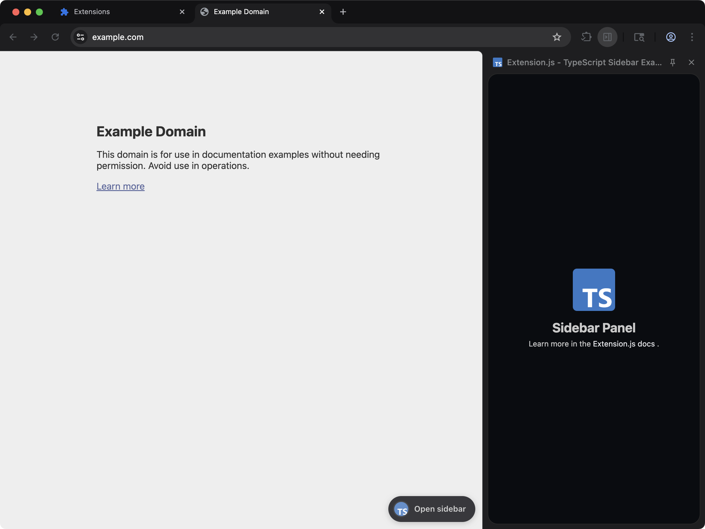</td>
    </tr>
    <tr><td>Version</td><td align="right">1.0.0</td></tr>
    <tr><td>Context</td><td align="right">Content Script, Sidebar, Background</td></tr>
    <tr><td>JavaScript framework</td><td align="right">JavaScript</td></tr>
    <tr><td>CSS</td><td align="right">CSS</td></tr>
    <tr>
      <td>Background included</td>
      <td align="right">Yes</td>
      <td align="center"><a href="https://templates.extension.dev/typescript">Start with this template &#8599;</a></td>
    </tr>
  </table>
</details>

<details>
  <summary> Sidebar Example</summary>

> Sidebar panel example. Adds a sidebar to the browser with a simple page.

  <table>
    <tr>
      <td>Repository</td>
      <td align="right"><a href="https://github.com/extension-js/examples/blob/main/examples/sidebar/README.md">examples/sidebar</a></td>
      <td rowspan="5">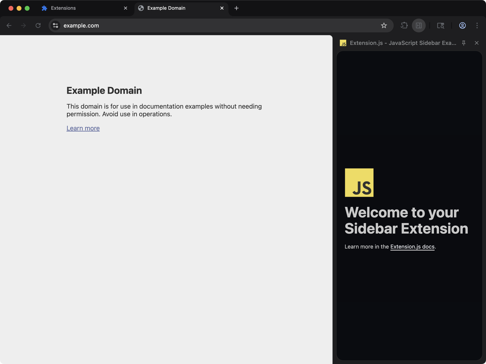</td>
    </tr>
    <tr><td>Version</td><td align="right">1.0.0</td></tr>
    <tr><td>Context</td><td align="right">Sidebar, Background</td></tr>
    <tr><td>JavaScript framework</td><td align="right">JavaScript</td></tr>
    <tr><td>CSS</td><td align="right">CSS</td></tr>
    <tr>
      <td>Background included</td>
      <td align="right">Yes</td>
      <td align="center"><a href="https://templates.extension.dev/sidebar">Start with this template &#8599;</a></td>
    </tr>
  </table>
</details>

<details>
  <summary>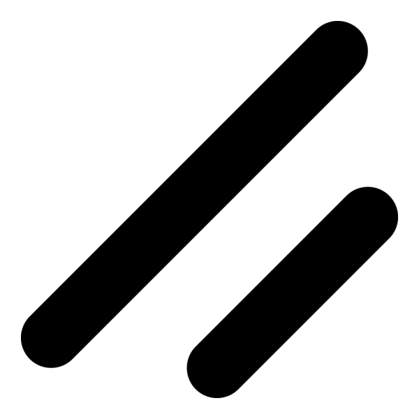 Sidebar Shadcn Example</summary>

> React sidebar example using shadcn/ui components. Adds a sidebar panel with a simple React page.

  <table>
    <tr>
      <td>Repository</td>
      <td align="right"><a href="https://github.com/extension-js/examples/blob/main/examples/sidebar-shadcn/README.md">examples/sidebar-shadcn</a></td>
      <td rowspan="5">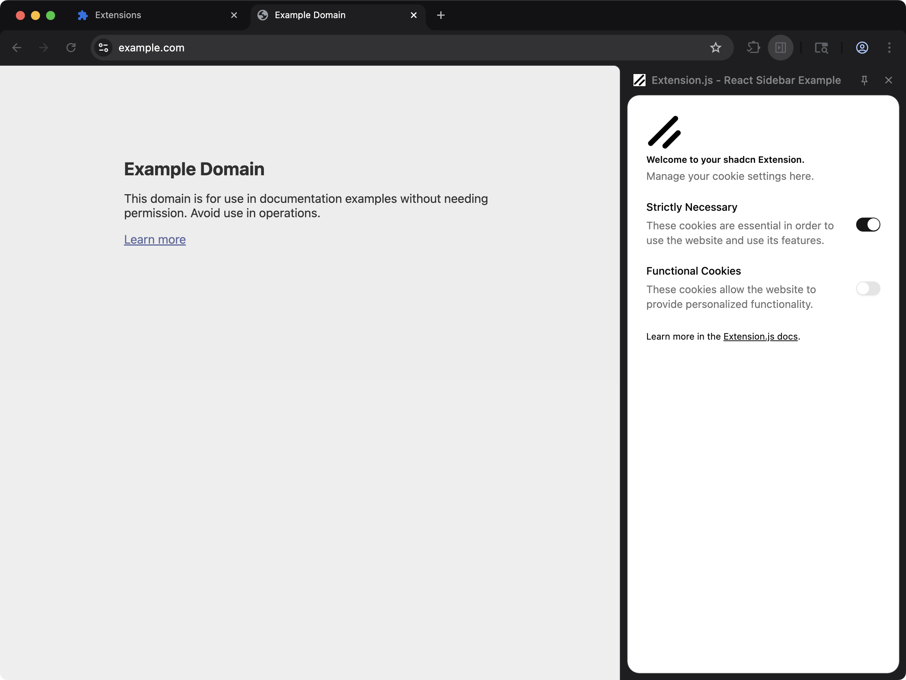</td>
    </tr>
    <tr><td>Version</td><td align="right">1.0.0</td></tr>
    <tr><td>Context</td><td align="right">Sidebar, Background</td></tr>
    <tr><td>JavaScript framework</td><td align="right">React</td></tr>
    <tr><td>CSS</td><td align="right">CSS</td></tr>
    <tr>
      <td>Background included</td>
      <td align="right">Yes</td>
      <td align="center"><a href="https://templates.extension.dev/sidebar-shadcn">Start with this template &#8599;</a></td>
    </tr>
  </table>
</details>

<details>
  <summary> Transformers JS Example</summary>

> Transformers.js demo with a sidebar and a content script: classify the active page or your selection on-device via WebGPU/WASM.

  <table>
    <tr>
      <td>Repository</td>
      <td align="right"><a href="https://github.com/extension-js/examples/blob/main/examples/transformers-js/README.md">examples/transformers-js</a></td>
      <td rowspan="5">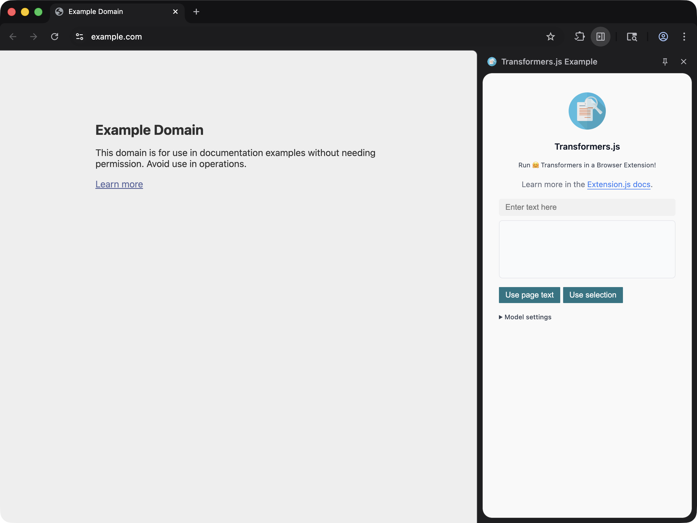</td>
    </tr>
    <tr><td>Version</td><td align="right">1.0.0</td></tr>
    <tr><td>Context</td><td align="right">Content, Sidebar, Background</td></tr>
    <tr><td>JavaScript framework</td><td align="right">JavaScript</td></tr>
    <tr><td>CSS</td><td align="right">CSS</td></tr>
    <tr>
      <td>Background included</td>
      <td align="right">Yes</td>
      <td align="center"><a href="https://templates.extension.dev/transformers-js">Start with this template &#8599;</a></td>
    </tr>
  </table>
</details>

<details>
  <summary> Sidebar Monorepo Turborepo Example</summary>

> Monorepo example with content script and sidebar.

  <table>
    <tr>
      <td>Repository</td>
      <td align="right"><a href="https://github.com/extension-js/examples/blob/main/examples/sidebar-monorepo-turborepo/README.md">examples/sidebar-monorepo-turborepo</a></td>
      <td rowspan="5">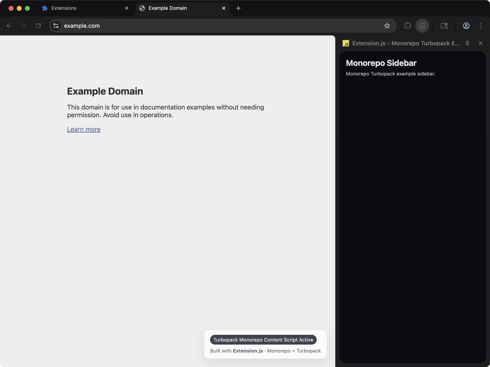</td>
    </tr>
    <tr><td>Version</td><td align="right">1.0.0</td></tr>
    <tr><td>Context</td><td align="right">Content Script, Sidebar, Background</td></tr>
    <tr><td>JavaScript framework</td><td align="right">JavaScript</td></tr>
    <tr><td>CSS</td><td align="right">CSS</td></tr>
    <tr>
      <td>Background included</td>
      <td align="right">Yes</td>
      <td align="center"><a href="https://templates.extension.dev/sidebar-monorepo-turborepo">Start with this template &#8599;</a></td>
    </tr>
  </table>
</details>

<details>
  <summary> Sidebar Monorepo Nx Example</summary>

> Monorepo example with content script and sidebar.

  <table>
    <tr>
      <td>Repository</td>
      <td align="right"><a href="https://github.com/extension-js/examples/blob/main/examples/sidebar-monorepo-nx/README.md">examples/sidebar-monorepo-nx</a></td>
      <td rowspan="5"></td>
    </tr>
    <tr><td>Version</td><td align="right">1.0.0</td></tr>
    <tr><td>Context</td><td align="right">Content Script, Sidebar, Background</td></tr>
    <tr><td>JavaScript framework</td><td align="right">JavaScript</td></tr>
    <tr><td>CSS</td><td align="right">CSS</td></tr>
    <tr>
      <td>Background included</td>
      <td align="right">Yes</td>
      <td align="center"><a href="https://templates.extension.dev/sidebar-monorepo-nx">Start with this template &#8599;</a></td>
    </tr>
  </table>
</details>

### Action

<details>
  <summary> Action Example</summary>

> Action popup example. Opens a toolbar popup with a simple page.

  <table>
    <tr>
      <td>Repository</td>
      <td align="right"><a href="https://github.com/extension-js/examples/blob/main/examples/action/README.md">examples/action</a></td>
      <td rowspan="5"></td>
    </tr>
    <tr><td>Version</td><td align="right">1.0.0</td></tr>
    <tr><td>Context</td><td align="right">Action, Background</td></tr>
    <tr><td>JavaScript framework</td><td align="right">JavaScript</td></tr>
    <tr><td>CSS</td><td align="right">CSS</td></tr>
    <tr>
      <td>Background included</td>
      <td align="right">Yes</td>
      <td align="center"><a href="https://templates.extension.dev/action">Start with this template &#8599;</a></td>
    </tr>
  </table>
</details>

<details>
  <summary> Action Locales Example</summary>

> Action popup example demonstrating i18n with \_locales and message placeholders.

  <table>
    <tr>
      <td>Repository</td>
      <td align="right"><a href="https://github.com/extension-js/examples/blob/main/examples/action-locales/README.md">examples/action-locales</a></td>
      <td rowspan="5">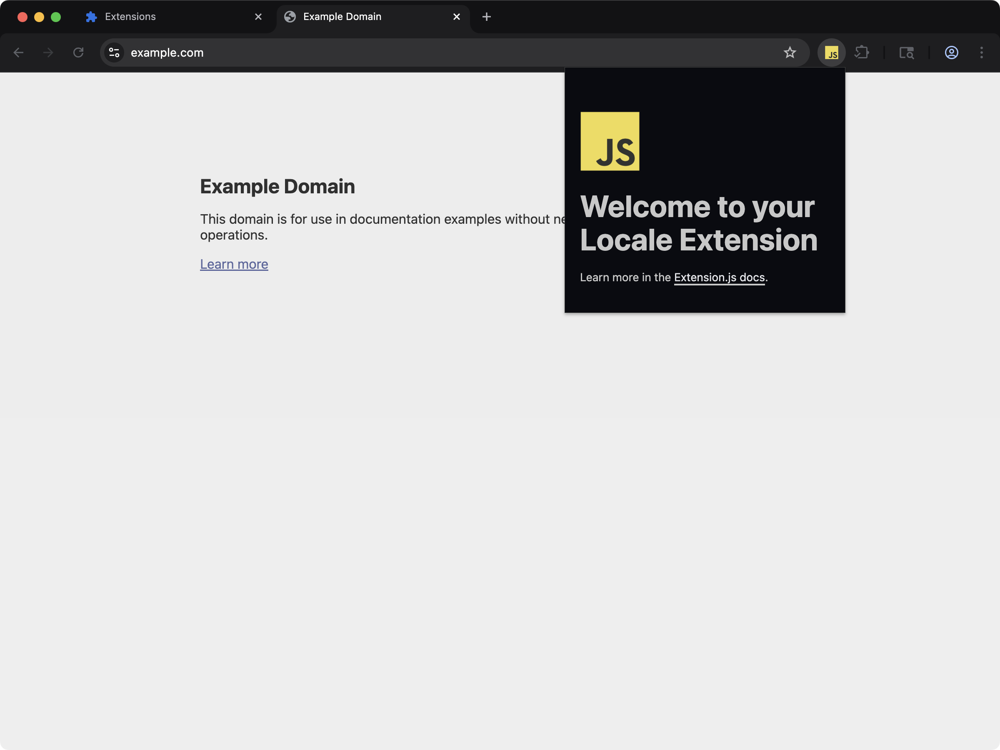</td>
    </tr>
    <tr><td>Version</td><td align="right">1.0.0</td></tr>
    <tr><td>Context</td><td align="right">Action, Background</td></tr>
    <tr><td>JavaScript framework</td><td align="right">JavaScript</td></tr>
    <tr><td>CSS</td><td align="right">CSS</td></tr>
    <tr>
      <td>Background included</td>
      <td align="right">Yes</td>
      <td align="center"><a href="https://templates.extension.dev/action-locales">Start with this template &#8599;</a></td>
    </tr>
  </table>
</details>

### DevTools

<details>
  <summary> DevTools Panel Example</summary>

> Adds a devtools panel to the browser that reads the inspected page.

  <table>
    <tr>
      <td>Repository</td>
      <td align="right"><a href="https://github.com/extension-js/examples/blob/main/examples/devtools/README.md">examples/devtools</a></td>
      <td rowspan="5">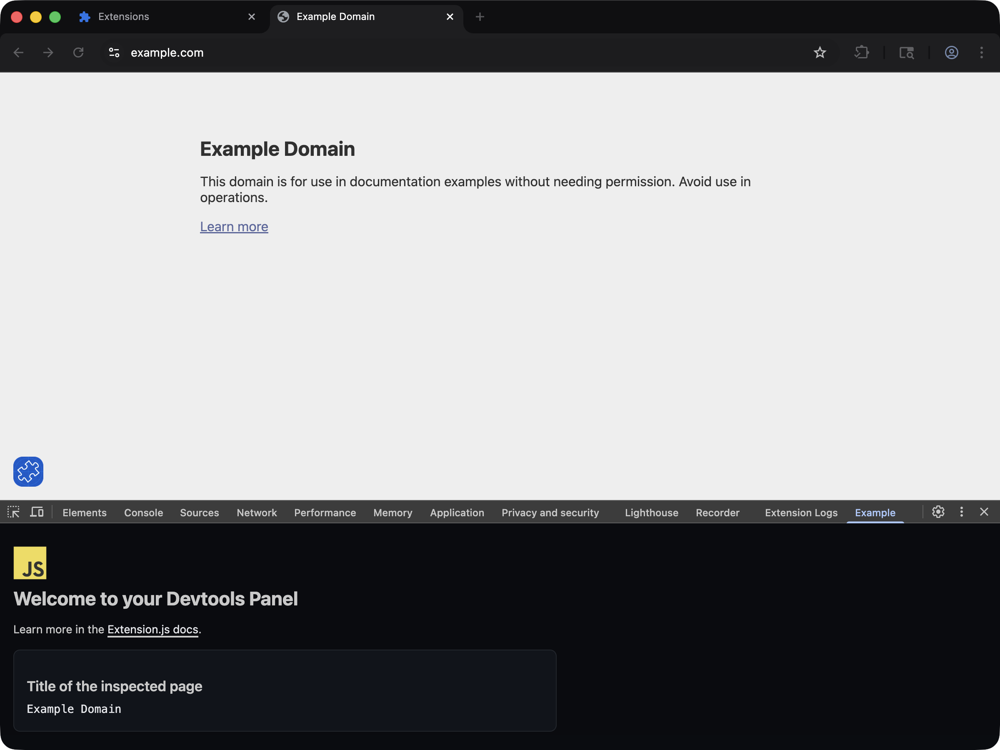</td>
    </tr>
    <tr><td>Version</td><td align="right">1.0.0</td></tr>
    <tr><td>Context</td><td align="right">DevTools</td></tr>
    <tr><td>JavaScript framework</td><td align="right">JavaScript</td></tr>
    <tr><td>CSS</td><td align="right">CSS</td></tr>
    <tr>
      <td>Background included</td>
      <td align="right">No</td>
      <td align="center"><a href="https://templates.extension.dev/devtools">Start with this template &#8599;</a></td>
    </tr>
  </table>
</details>

<details>
  <summary> React DevTools Panel Example</summary>

> Adds a React devtools panel to the browser that reads the inspected page.

  <table>
    <tr>
      <td>Repository</td>
      <td align="right"><a href="https://github.com/extension-js/examples/blob/main/examples/devtools-react/README.md">examples/devtools-react</a></td>
      <td rowspan="5">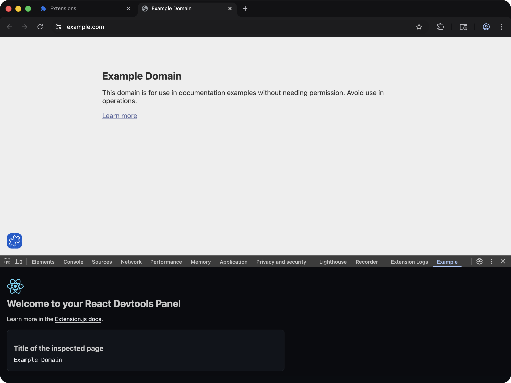</td>
    </tr>
    <tr><td>Version</td><td align="right">1.0.0</td></tr>
    <tr><td>Context</td><td align="right">DevTools</td></tr>
    <tr><td>JavaScript framework</td><td align="right">React</td></tr>
    <tr><td>CSS</td><td align="right">CSS</td></tr>
    <tr>
      <td>Background included</td>
      <td align="right">No</td>
      <td align="center"><a href="https://templates.extension.dev/devtools-react">Start with this template &#8599;</a></td>
    </tr>
  </table>
</details>

<details>
  <summary> Preact DevTools Panel Example</summary>

> Adds a devtools panel written in Preact that reads the inspected page.

  <table>
    <tr>
      <td>Repository</td>
      <td align="right"><a href="https://github.com/extension-js/examples/blob/main/examples/devtools-preact/README.md">examples/devtools-preact</a></td>
      <td rowspan="5">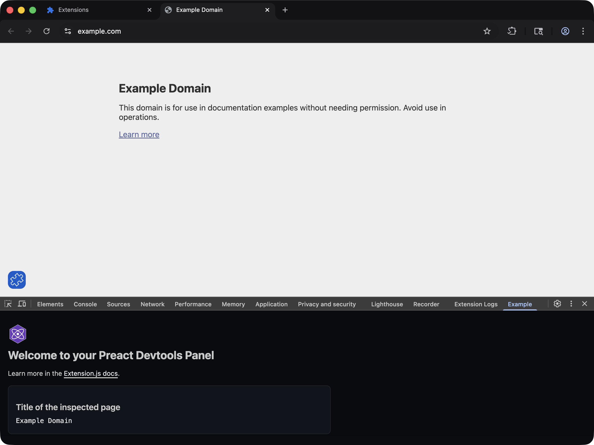</td>
    </tr>
    <tr><td>Version</td><td align="right">1.0.0</td></tr>
    <tr><td>Context</td><td align="right">DevTools</td></tr>
    <tr><td>JavaScript framework</td><td align="right">Preact</td></tr>
    <tr><td>CSS</td><td align="right">CSS</td></tr>
    <tr>
      <td>Background included</td>
      <td align="right">No</td>
      <td align="center"><a href="https://templates.extension.dev/devtools-preact">Start with this template &#8599;</a></td>
    </tr>
  </table>
</details>

<details>
  <summary> TypeScript DevTools Panel Example</summary>

> Adds a devtools panel to the browser that reads the inspected page.

  <table>
    <tr>
      <td>Repository</td>
      <td align="right"><a href="https://github.com/extension-js/examples/blob/main/examples/devtools-typescript/README.md">examples/devtools-typescript</a></td>
      <td rowspan="5">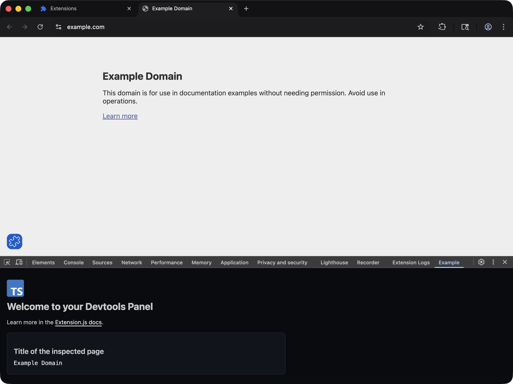</td>
    </tr>
    <tr><td>Version</td><td align="right">1.0.0</td></tr>
    <tr><td>Context</td><td align="right">DevTools</td></tr>
    <tr><td>JavaScript framework</td><td align="right">TypeScript</td></tr>
    <tr><td>CSS</td><td align="right">CSS</td></tr>
    <tr>
      <td>Background included</td>
      <td align="right">No</td>
      <td align="center"><a href="https://templates.extension.dev/devtools-typescript">Start with this template &#8599;</a></td>
    </tr>
  </table>
</details>

<details>
  <summary> Svelte DevTools Panel Example</summary>

> Adds a Svelte devtools panel to the browser that reads the inspected page.

  <table>
    <tr>
      <td>Repository</td>
      <td align="right"><a href="https://github.com/extension-js/examples/blob/main/examples/devtools-svelte/README.md">examples/devtools-svelte</a></td>
      <td rowspan="5">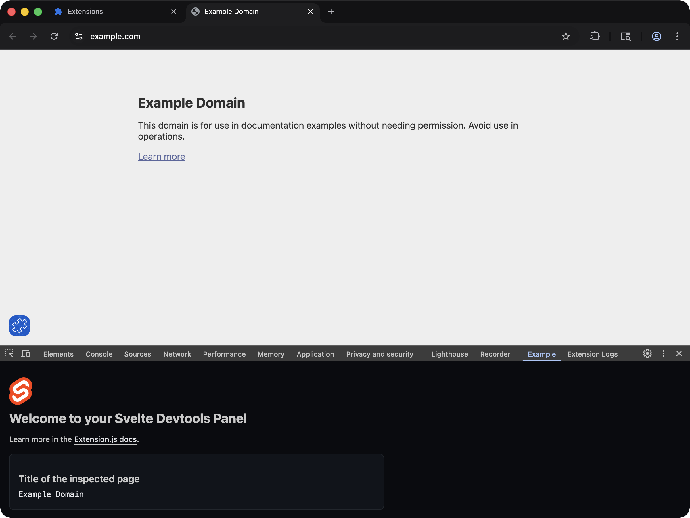</td>
    </tr>
    <tr><td>Version</td><td align="right">1.0.0</td></tr>
    <tr><td>Context</td><td align="right">DevTools</td></tr>
    <tr><td>JavaScript framework</td><td align="right">Svelte</td></tr>
    <tr><td>CSS</td><td align="right">CSS</td></tr>
    <tr>
      <td>Background included</td>
      <td align="right">No</td>
      <td align="center"><a href="https://templates.extension.dev/devtools-svelte">Start with this template &#8599;</a></td>
    </tr>
  </table>
</details>

<details>
  <summary> Vue DevTools Panel Example</summary>

> Adds a devtools panel built with Vue that reads the inspected page.

  <table>
    <tr>
      <td>Repository</td>
      <td align="right"><a href="https://github.com/extension-js/examples/blob/main/examples/devtools-vue/README.md">examples/devtools-vue</a></td>
      <td rowspan="5">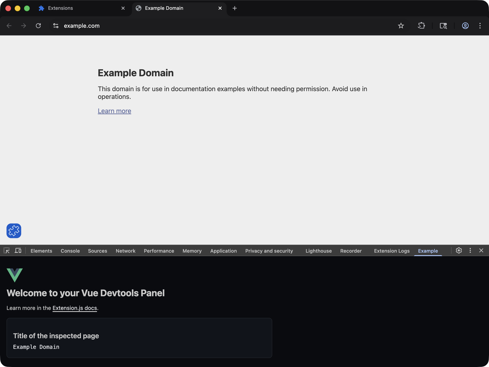</td>
    </tr>
    <tr><td>Version</td><td align="right">1.0.0</td></tr>
    <tr><td>Context</td><td align="right">DevTools</td></tr>
    <tr><td>JavaScript framework</td><td align="right">Vue</td></tr>
    <tr><td>CSS</td><td align="right">CSS</td></tr>
    <tr>
      <td>Background included</td>
      <td align="right">No</td>
      <td align="center"><a href="https://templates.extension.dev/devtools-vue">Start with this template &#8599;</a></td>
    </tr>
  </table>
</details>

### Content

<details>
  <summary>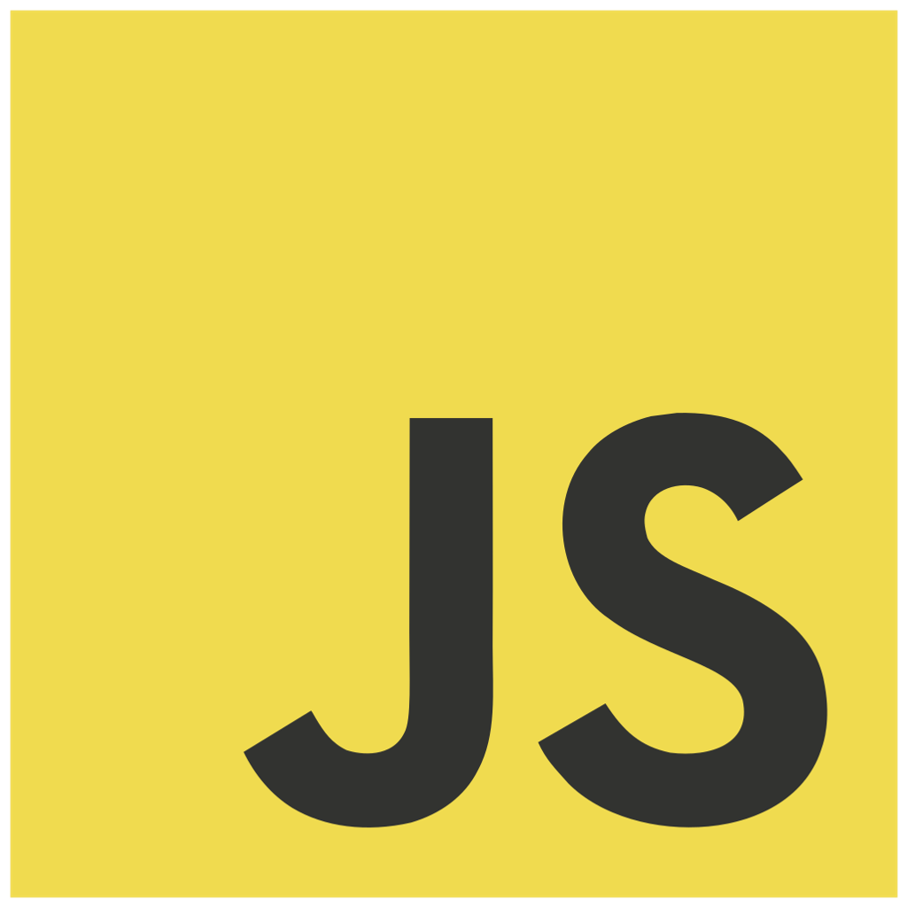 Content Example</summary>

> Injects a small badge into every web page you visit, with an options page that moves it to the left or right edge.

  <table>
    <tr>
      <td>Repository</td>
      <td align="right"><a href="https://github.com/extension-js/examples/blob/main/examples/content/README.md">examples/content</a></td>
      <td rowspan="5"></td>
    </tr>
    <tr><td>Version</td><td align="right">1.0.0</td></tr>
    <tr><td>Context</td><td align="right">Content Script, Options, Background</td></tr>
    <tr><td>JavaScript framework</td><td align="right">JavaScript</td></tr>
    <tr><td>CSS</td><td align="right">CSS</td></tr>
    <tr>
      <td>Background included</td>
      <td align="right">Yes</td>
      <td align="center"><a href="https://templates.extension.dev/content">Start with this template &#8599;</a></td>
    </tr>
  </table>
</details>

<details>
  <summary>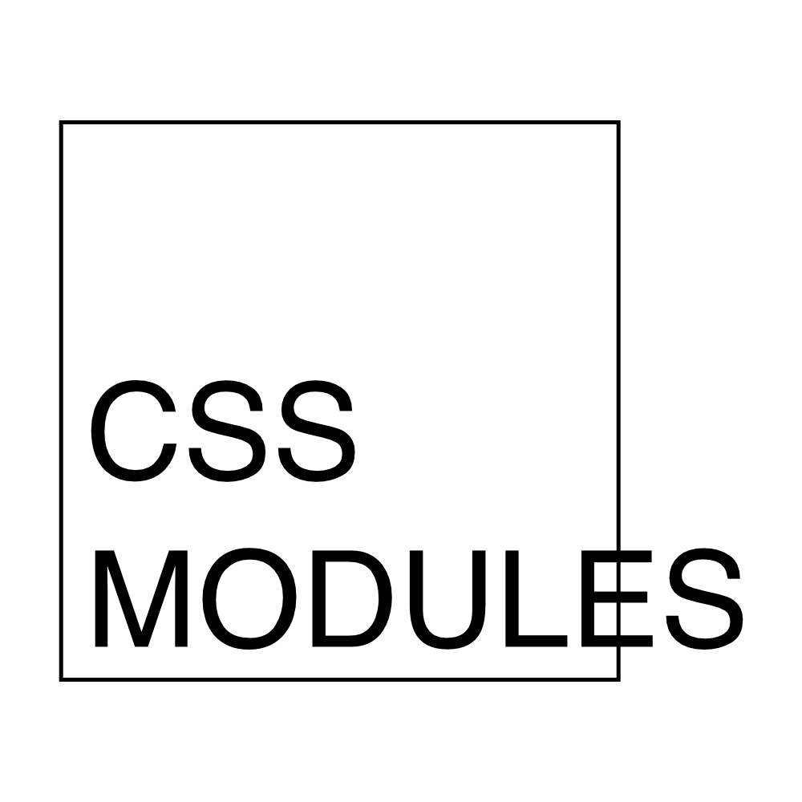 Content CSS Modules Example</summary>

> Injects a small styled badge into every web page you visit.

  <table>
    <tr>
      <td>Repository</td>
      <td align="right"><a href="https://github.com/extension-js/examples/blob/main/examples/content-css-modules/README.md">examples/content-css-modules</a></td>
      <td rowspan="5">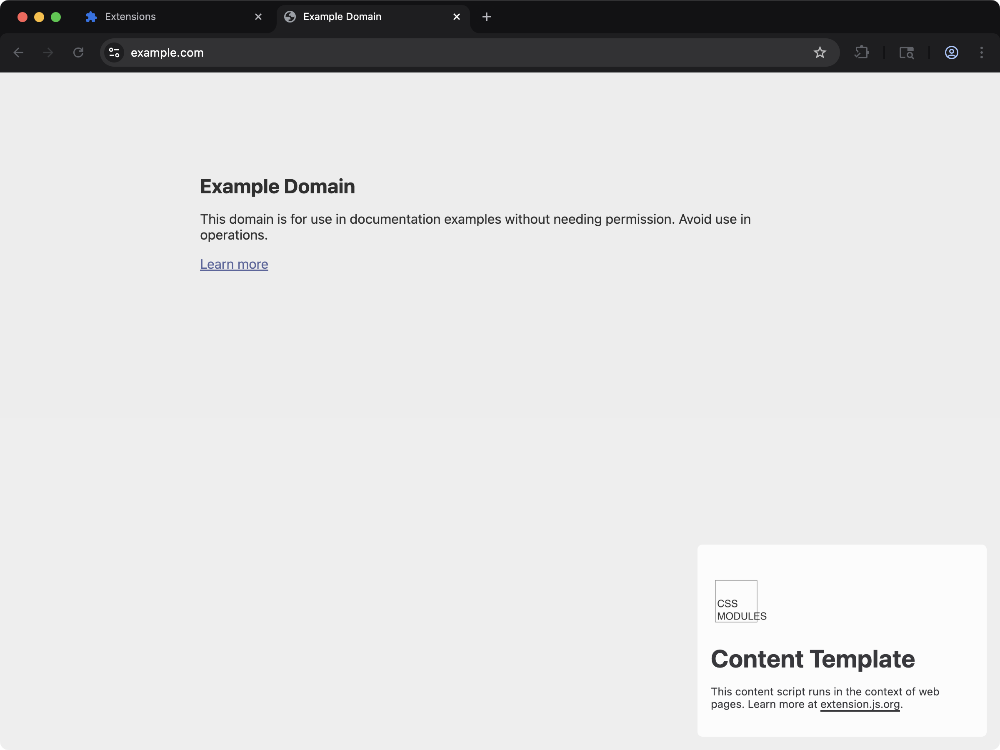</td>
    </tr>
    <tr><td>Version</td><td align="right">1.0.0</td></tr>
    <tr><td>Context</td><td align="right">Content Script, Background</td></tr>
    <tr><td>JavaScript framework</td><td align="right">JavaScript</td></tr>
    <tr><td>CSS</td><td align="right">CSS</td></tr>
    <tr>
      <td>Background included</td>
      <td align="right">Yes</td>
      <td align="center"><a href="https://templates.extension.dev/content-css-modules">Start with this template &#8599;</a></td>
    </tr>
  </table>
</details>

<details>
  <summary> Content Custom Font Example</summary>

> Injects a badge rendered in a custom font into every web page you visit.

  <table>
    <tr>
      <td>Repository</td>
      <td align="right"><a href="https://github.com/extension-js/examples/blob/main/examples/content-custom-font/README.md">examples/content-custom-font</a></td>
      <td rowspan="5">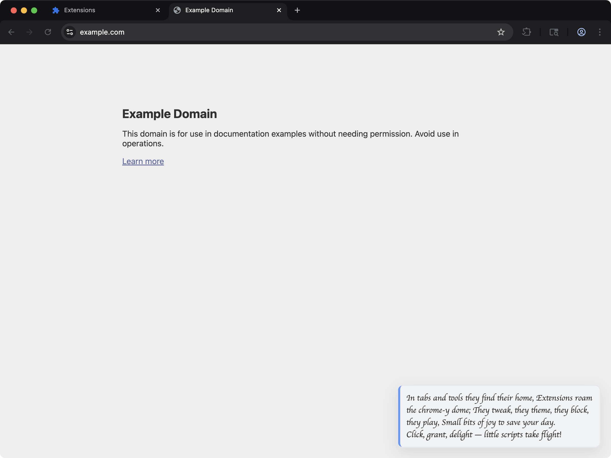</td>
    </tr>
    <tr><td>Version</td><td align="right">1.0.0</td></tr>
    <tr><td>Context</td><td align="right">Content Script, Background</td></tr>
    <tr><td>JavaScript framework</td><td align="right">JavaScript</td></tr>
    <tr><td>CSS</td><td align="right">CSS</td></tr>
    <tr>
      <td>Background included</td>
      <td align="right">Yes</td>
      <td align="center"><a href="https://templates.extension.dev/content-custom-font">Start with this template &#8599;</a></td>
    </tr>
  </table>
</details>

<details>
  <summary> Content Env Example</summary>

> Injects a small panel showing the extension's environment values into every web page you visit.

  <table>
    <tr>
      <td>Repository</td>
      <td align="right"><a href="https://github.com/extension-js/examples/blob/main/examples/content-env/README.md">examples/content-env</a></td>
      <td rowspan="5">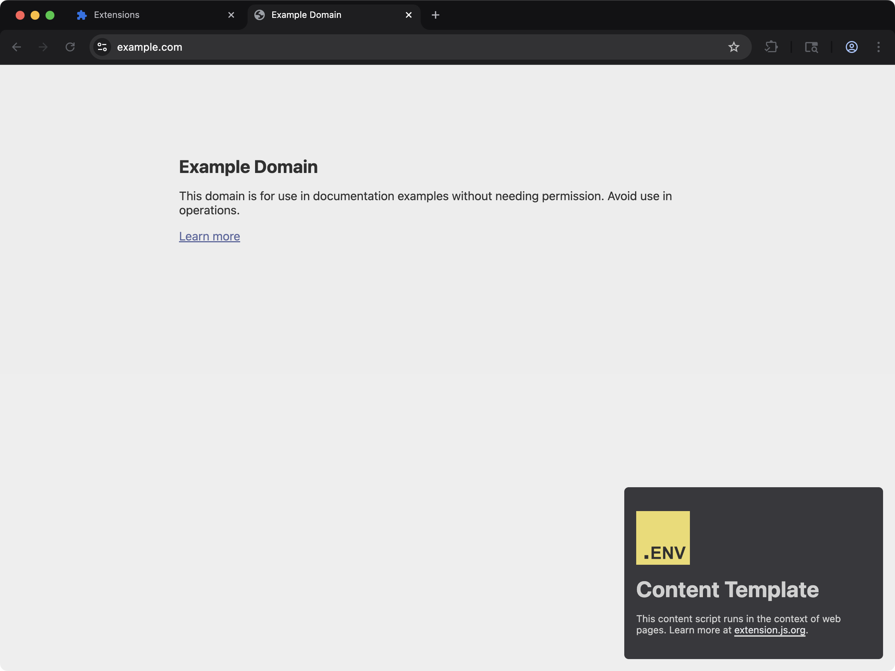</td>
    </tr>
    <tr><td>Version</td><td align="right">1.0.0</td></tr>
    <tr><td>Context</td><td align="right">Content Script, Background</td></tr>
    <tr><td>JavaScript framework</td><td align="right">JavaScript</td></tr>
    <tr><td>CSS</td><td align="right">CSS</td></tr>
    <tr>
      <td>Background included</td>
      <td align="right">Yes</td>
      <td align="center"><a href="https://templates.extension.dev/content-env">Start with this template &#8599;</a></td>
    </tr>
  </table>
</details>

<details>
  <summary> Content Less Example</summary>

> Injects a small styled badge into every web page you visit.

  <table>
    <tr>
      <td>Repository</td>
      <td align="right"><a href="https://github.com/extension-js/examples/blob/main/examples/content-less/README.md">examples/content-less</a></td>
      <td rowspan="5"></td>
    </tr>
    <tr><td>Version</td><td align="right">1.0.0</td></tr>
    <tr><td>Context</td><td align="right">Content Script, Background</td></tr>
    <tr><td>JavaScript framework</td><td align="right">JavaScript</td></tr>
    <tr><td>CSS</td><td align="right">Less</td></tr>
    <tr>
      <td>Background included</td>
      <td align="right">Yes</td>
      <td align="center"><a href="https://templates.extension.dev/content-less">Start with this template &#8599;</a></td>
    </tr>
  </table>
</details>

<details>
  <summary> Content Less Modules Example</summary>

> Injects a small styled badge into every web page you visit.

  <table>
    <tr>
      <td>Repository</td>
      <td align="right"><a href="https://github.com/extension-js/examples/blob/main/examples/content-less-modules/README.md">examples/content-less-modules</a></td>
      <td rowspan="5">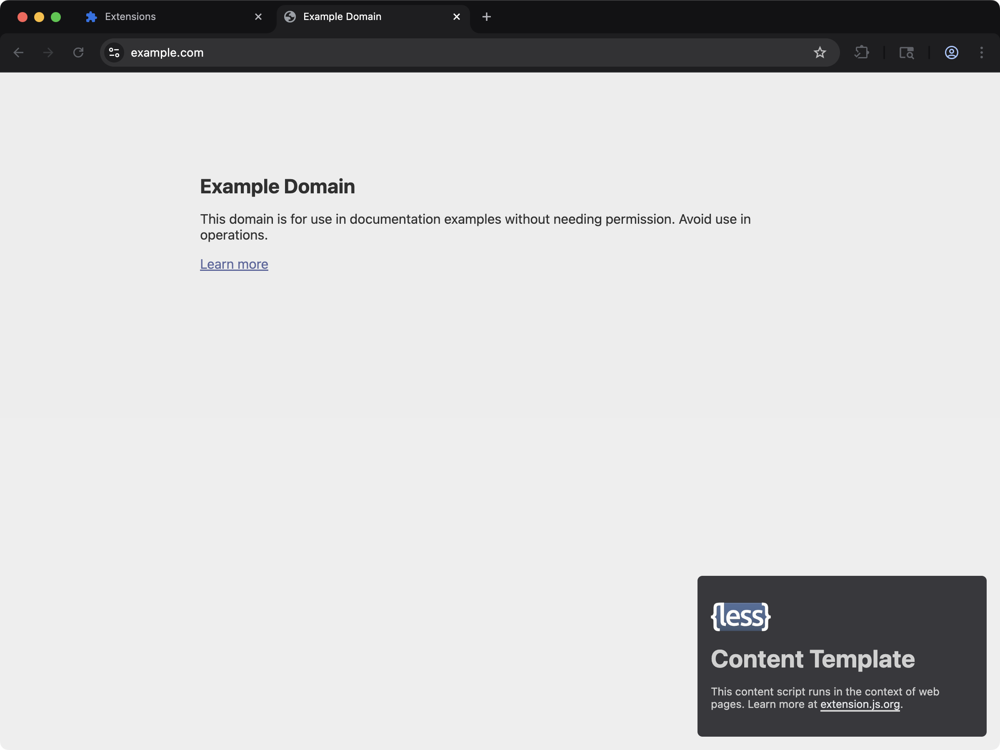</td>
    </tr>
    <tr><td>Version</td><td align="right">1.0.0</td></tr>
    <tr><td>Context</td><td align="right">Content Script, Background</td></tr>
    <tr><td>JavaScript framework</td><td align="right">JavaScript</td></tr>
    <tr><td>CSS</td><td align="right">Less</td></tr>
    <tr>
      <td>Background included</td>
      <td align="right">Yes</td>
      <td align="center"><a href="https://templates.extension.dev/content-less-modules">Start with this template &#8599;</a></td>
    </tr>
  </table>
</details>

<details>
  <summary> Content Multi One Entry Example</summary>

> Injects four small elements into every web page you visit.

  <table>
    <tr>
      <td>Repository</td>
      <td align="right"><a href="https://github.com/extension-js/examples/blob/main/examples/content-multi-one-entry/README.md">examples/content-multi-one-entry</a></td>
      <td rowspan="5"></td>
    </tr>
    <tr><td>Version</td><td align="right">1.0.0</td></tr>
    <tr><td>Context</td><td align="right">Content Script, Background</td></tr>
    <tr><td>JavaScript framework</td><td align="right">JavaScript</td></tr>
    <tr><td>CSS</td><td align="right">CSS</td></tr>
    <tr>
      <td>Background included</td>
      <td align="right">Yes</td>
      <td align="center"><a href="https://templates.extension.dev/content-multi-one-entry">Start with this template &#8599;</a></td>
    </tr>
  </table>
</details>

<details>
  <summary> Content Multi Three Entries Example</summary>

> Injects four small elements into every web page you visit.

  <table>
    <tr>
      <td>Repository</td>
      <td align="right"><a href="https://github.com/extension-js/examples/blob/main/examples/content-multi-three-entries/README.md">examples/content-multi-three-entries</a></td>
      <td rowspan="5"></td>
    </tr>
    <tr><td>Version</td><td align="right">1.0.0</td></tr>
    <tr><td>Context</td><td align="right">Content Script, Background</td></tr>
    <tr><td>JavaScript framework</td><td align="right">JavaScript</td></tr>
    <tr><td>CSS</td><td align="right">CSS</td></tr>
    <tr>
      <td>Background included</td>
      <td align="right">Yes</td>
      <td align="center"><a href="https://templates.extension.dev/content-multi-three-entries">Start with this template &#8599;</a></td>
    </tr>
  </table>
</details>

<details>
  <summary> Content Preact Example</summary>

> Shows an overlay UI on web pages and an options page that moves it from right to left.

  <table>
    <tr>
      <td>Repository</td>
      <td align="right"><a href="https://github.com/extension-js/examples/blob/main/examples/content-preact/README.md">examples/content-preact</a></td>
      <td rowspan="5"></td>
    </tr>
    <tr><td>Version</td><td align="right">1.0.0</td></tr>
    <tr><td>Context</td><td align="right">Content Script, Options, Background</td></tr>
    <tr><td>JavaScript framework</td><td align="right">Preact</td></tr>
    <tr><td>CSS</td><td align="right">CSS</td></tr>
    <tr>
      <td>Background included</td>
      <td align="right">Yes</td>
      <td align="center"><a href="https://templates.extension.dev/content-preact">Start with this template &#8599;</a></td>
    </tr>
  </table>
</details>

<details>
  <summary> Content React Example</summary>

> Shows a small overlay UI on every web page, with a React options page that moves it from right to left.

  <table>
    <tr>
      <td>Repository</td>
      <td align="right"><a href="https://github.com/extension-js/examples/blob/main/examples/content-react/README.md">examples/content-react</a></td>
      <td rowspan="5">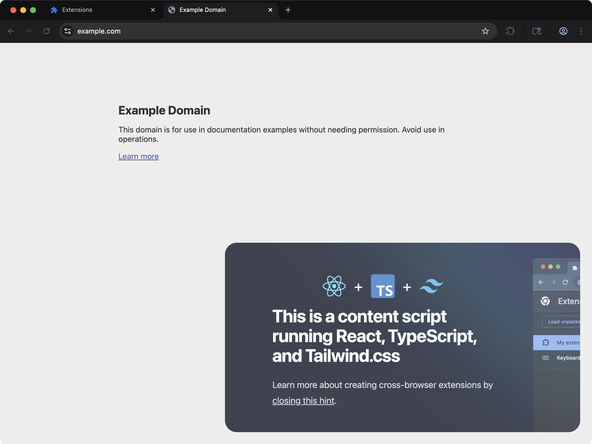</td>
    </tr>
    <tr><td>Version</td><td align="right">1.0.0</td></tr>
    <tr><td>Context</td><td align="right">Content Script, Options, Background</td></tr>
    <tr><td>JavaScript framework</td><td align="right">React</td></tr>
    <tr><td>CSS</td><td align="right">CSS</td></tr>
    <tr>
      <td>Background included</td>
      <td align="right">Yes</td>
      <td align="center"><a href="https://templates.extension.dev/content-react">Start with this template &#8599;</a></td>
    </tr>
  </table>
</details>

<details>
  <summary> Content Sass Example</summary>

> Injects a small styled badge into every web page you visit.

  <table>
    <tr>
      <td>Repository</td>
      <td align="right"><a href="https://github.com/extension-js/examples/blob/main/examples/content-sass/README.md">examples/content-sass</a></td>
      <td rowspan="5">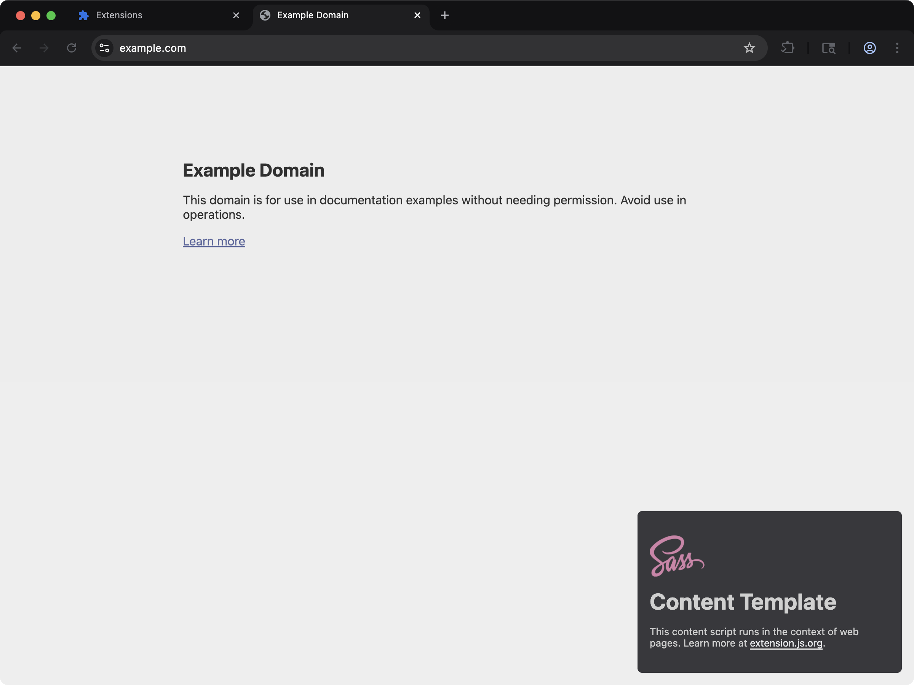</td>
    </tr>
    <tr><td>Version</td><td align="right">1.0.0</td></tr>
    <tr><td>Context</td><td align="right">Content Script, Background</td></tr>
    <tr><td>JavaScript framework</td><td align="right">JavaScript</td></tr>
    <tr><td>CSS</td><td align="right">Sass</td></tr>
    <tr>
      <td>Background included</td>
      <td align="right">Yes</td>
      <td align="center"><a href="https://templates.extension.dev/content-sass">Start with this template &#8599;</a></td>
    </tr>
  </table>
</details>

<details>
  <summary> Content Sass Modules Example</summary>

> Injects a small styled badge into every web page you visit.

  <table>
    <tr>
      <td>Repository</td>
      <td align="right"><a href="https://github.com/extension-js/examples/blob/main/examples/content-sass-modules/README.md">examples/content-sass-modules</a></td>
      <td rowspan="5"></td>
    </tr>
    <tr><td>Version</td><td align="right">1.0.0</td></tr>
    <tr><td>Context</td><td align="right">Content Script, Background</td></tr>
    <tr><td>JavaScript framework</td><td align="right">JavaScript</td></tr>
    <tr><td>CSS</td><td align="right">Sass</td></tr>
    <tr>
      <td>Background included</td>
      <td align="right">Yes</td>
      <td align="center"><a href="https://templates.extension.dev/content-sass-modules">Start with this template &#8599;</a></td>
    </tr>
  </table>
</details>

<details>
  <summary> Content Svelte Example</summary>

> Shows a Svelte overlay on every web page you visit, with an options page that moves it from right to left.

  <table>
    <tr>
      <td>Repository</td>
      <td align="right"><a href="https://github.com/extension-js/examples/blob/main/examples/content-svelte/README.md">examples/content-svelte</a></td>
      <td rowspan="5">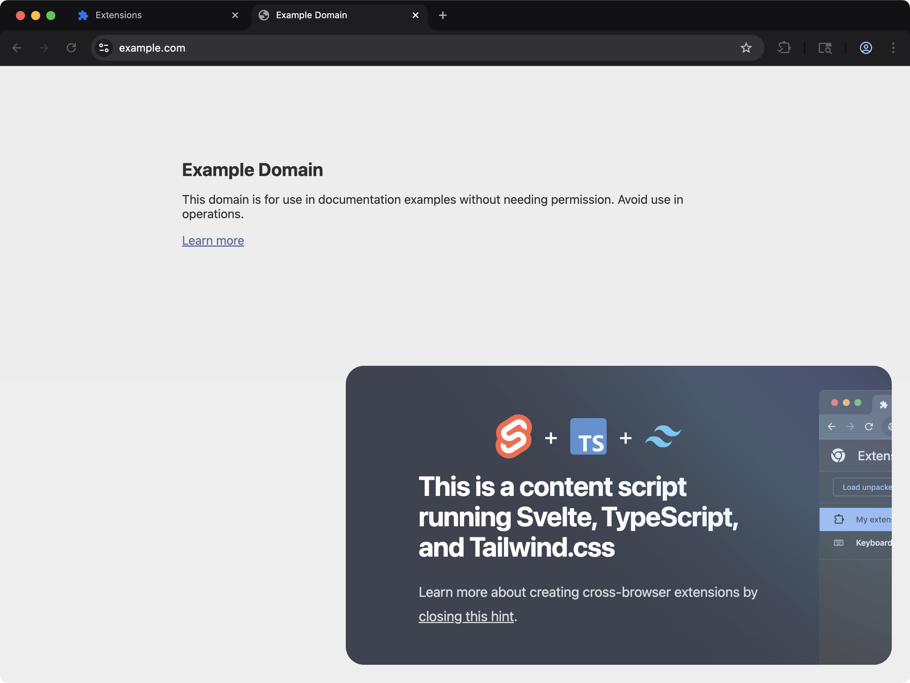</td>
    </tr>
    <tr><td>Version</td><td align="right">1.0.0</td></tr>
    <tr><td>Context</td><td align="right">Content Script, Options, Background</td></tr>
    <tr><td>JavaScript framework</td><td align="right">Svelte</td></tr>
    <tr><td>CSS</td><td align="right">CSS</td></tr>
    <tr>
      <td>Background included</td>
      <td align="right">Yes</td>
      <td align="center"><a href="https://templates.extension.dev/content-svelte">Start with this template &#8599;</a></td>
    </tr>
  </table>
</details>

<details>
  <summary> Content TypeScript Example</summary>

> Shows a small overlay UI on every web page, with an options page that moves it from right to left.

  <table>
    <tr>
      <td>Repository</td>
      <td align="right"><a href="https://github.com/extension-js/examples/blob/main/examples/content-typescript/README.md">examples/content-typescript</a></td>
      <td rowspan="5">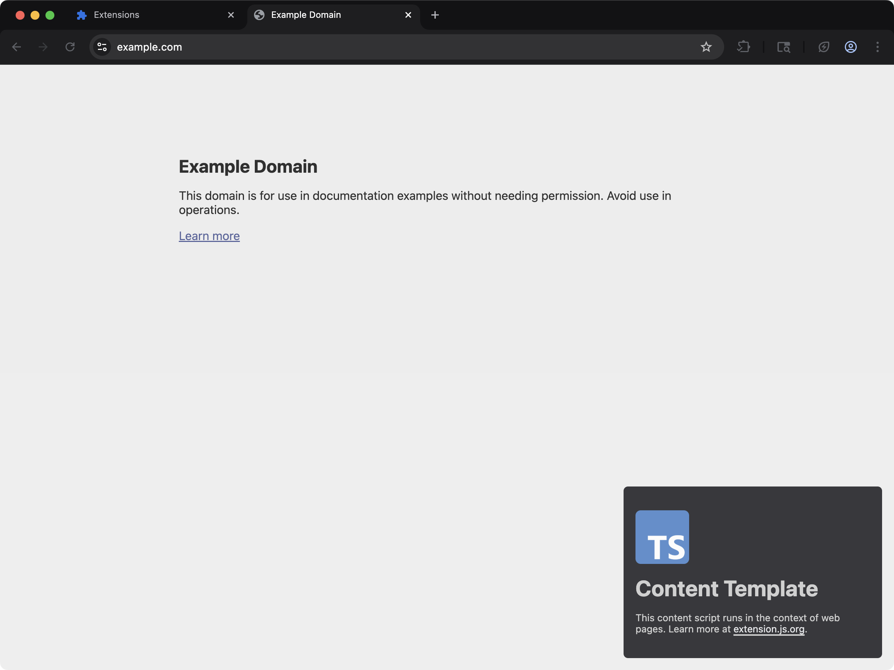</td>
    </tr>
    <tr><td>Version</td><td align="right">1.0.0</td></tr>
    <tr><td>Context</td><td align="right">Content Script, Options, Background</td></tr>
    <tr><td>JavaScript framework</td><td align="right">JavaScript</td></tr>
    <tr><td>CSS</td><td align="right">CSS</td></tr>
    <tr>
      <td>Background included</td>
      <td align="right">Yes</td>
      <td align="center"><a href="https://templates.extension.dev/content-typescript">Start with this template &#8599;</a></td>
    </tr>
  </table>
</details>

<details>
  <summary> Content Vue Example</summary>

> Shows a small overlay UI on every web page, with a Vue options page that moves it from right to left.

  <table>
    <tr>
      <td>Repository</td>
      <td align="right"><a href="https://github.com/extension-js/examples/blob/main/examples/content-vue/README.md">examples/content-vue</a></td>
      <td rowspan="5"></td>
    </tr>
    <tr><td>Version</td><td align="right">1.0.0</td></tr>
    <tr><td>Context</td><td align="right">Content Script, Options, Background</td></tr>
    <tr><td>JavaScript framework</td><td align="right">Vue</td></tr>
    <tr><td>CSS</td><td align="right">CSS</td></tr>
    <tr>
      <td>Background included</td>
      <td align="right">Yes</td>
      <td align="center"><a href="https://templates.extension.dev/content-vue">Start with this template &#8599;</a></td>
    </tr>
  </table>
</details>

### New

<details>
  <summary> New Example</summary>

> New tab page example using plain JavaScript. Renders a simple page you can customize.

  <table>
    <tr>
      <td>Repository</td>
      <td align="right"><a href="https://github.com/extension-js/examples/blob/main/examples/newtab/README.md">examples/newtab</a></td>
      <td rowspan="5">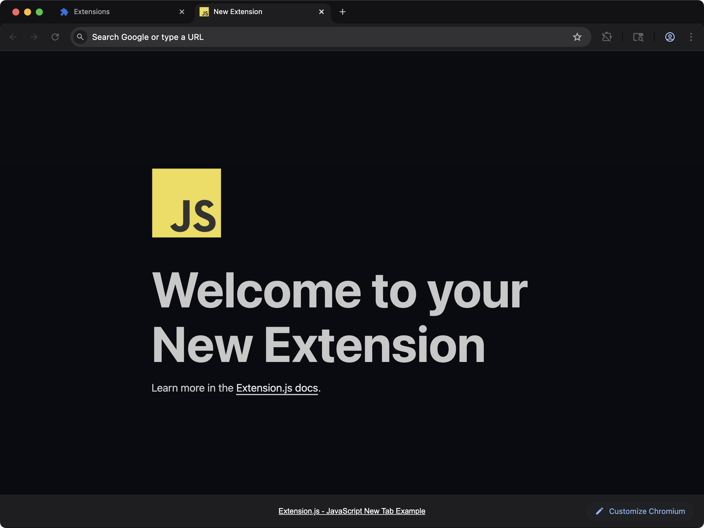</td>
    </tr>
    <tr><td>Version</td><td align="right">1.0.0</td></tr>
    <tr><td>Context</td><td align="right">New Tab, Background</td></tr>
    <tr><td>JavaScript framework</td><td align="right">JavaScript</td></tr>
    <tr><td>CSS</td><td align="right">CSS</td></tr>
    <tr>
      <td>Background included</td>
      <td align="right">Yes</td>
      <td align="center"><a href="https://templates.extension.dev/newtab">Start with this template &#8599;</a></td>
    </tr>
  </table>
</details>

<details>
  <summary> New Browser Flags Example</summary>

> A browser extension example built with Extension.js demonstrating browser-specific features and flags. Shows how to handle browser differences across targets.

  <table>
    <tr>
      <td>Repository</td>
      <td align="right"><a href="https://github.com/extension-js/examples/blob/main/examples/newtab-browser-flags/README.md">examples/newtab-browser-flags</a></td>
      <td rowspan="5">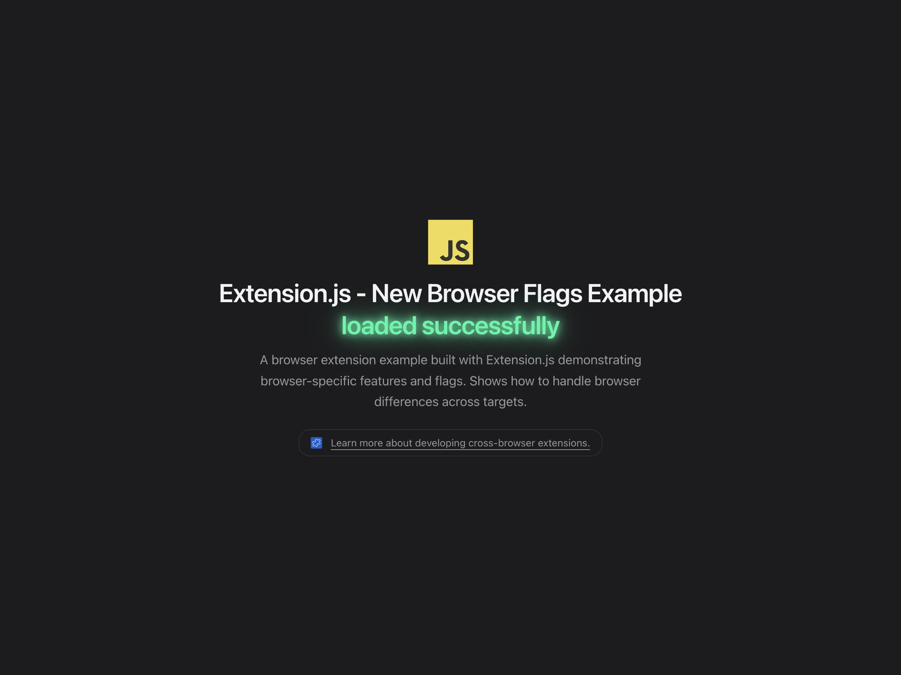</td>
    </tr>
    <tr><td>Version</td><td align="right">1.0.0</td></tr>
    <tr><td>Context</td><td align="right">Content Script, New Tab, Sidebar, Background</td></tr>
    <tr><td>JavaScript framework</td><td align="right">JavaScript</td></tr>
    <tr><td>CSS</td><td align="right">CSS</td></tr>
    <tr>
      <td>Background included</td>
      <td align="right">Yes</td>
      <td align="center"><a href="https://templates.extension.dev/newtab-browser-flags">Start with this template &#8599;</a></td>
    </tr>
  </table>
</details>

<details>
  <summary>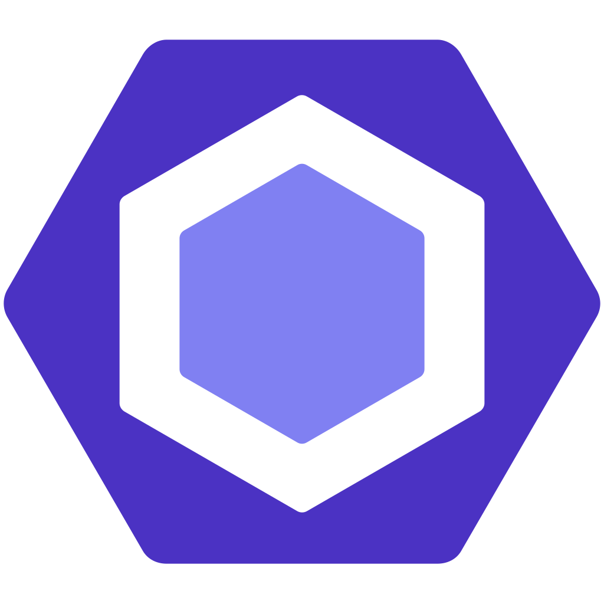 New Config ESLint Example</summary>

> New tab page example with ESLint configured. Shows how linting is set up in an extension project.

  <table>
    <tr>
      <td>Repository</td>
      <td align="right"><a href="https://github.com/extension-js/examples/blob/main/examples/newtab-config-eslint/README.md">examples/newtab-config-eslint</a></td>
      <td rowspan="5">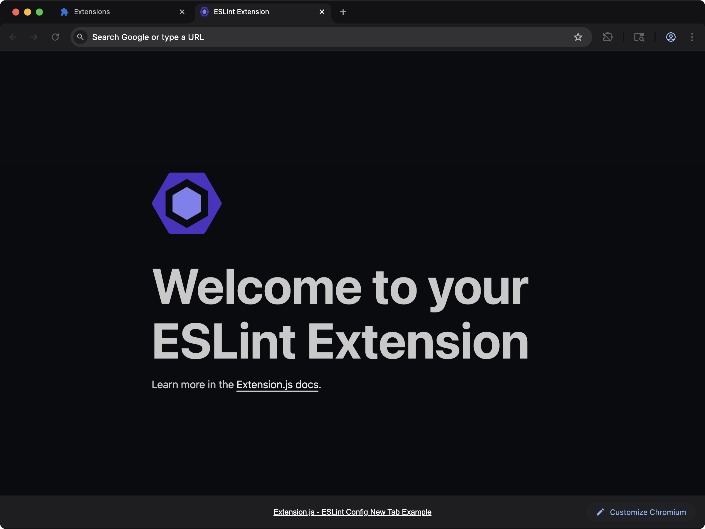</td>
    </tr>
    <tr><td>Version</td><td align="right">1.0.0</td></tr>
    <tr><td>Context</td><td align="right">New Tab, Background</td></tr>
    <tr><td>JavaScript framework</td><td align="right">JavaScript</td></tr>
    <tr><td>CSS</td><td align="right">CSS</td></tr>
    <tr>
      <td>Background included</td>
      <td align="right">Yes</td>
      <td align="center"><a href="https://templates.extension.dev/newtab-config-eslint">Start with this template &#8599;</a></td>
    </tr>
  </table>
</details>

<details>
  <summary>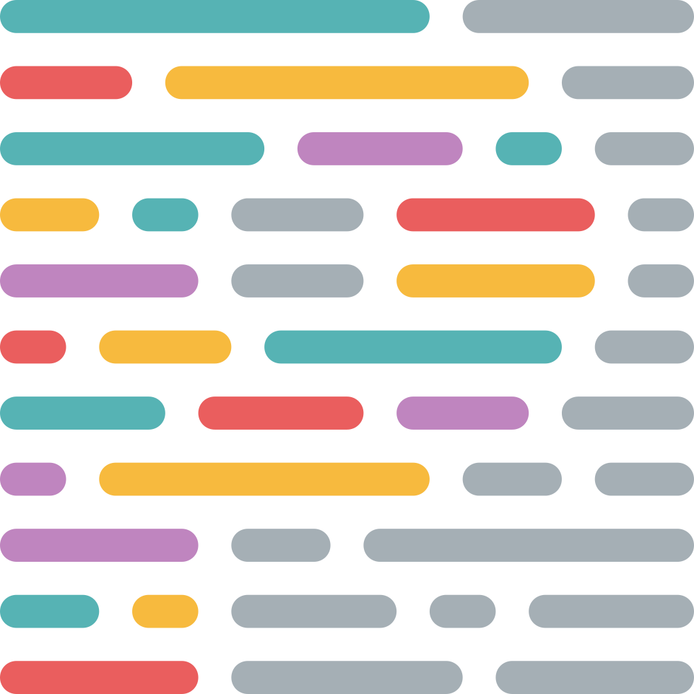 New Config Prettier Example</summary>

> New tab page example with Prettier configured. Shows how formatting is set up in an extension project.

  <table>
    <tr>
      <td>Repository</td>
      <td align="right"><a href="https://github.com/extension-js/examples/blob/main/examples/newtab-config-prettier/README.md">examples/newtab-config-prettier</a></td>
      <td rowspan="5">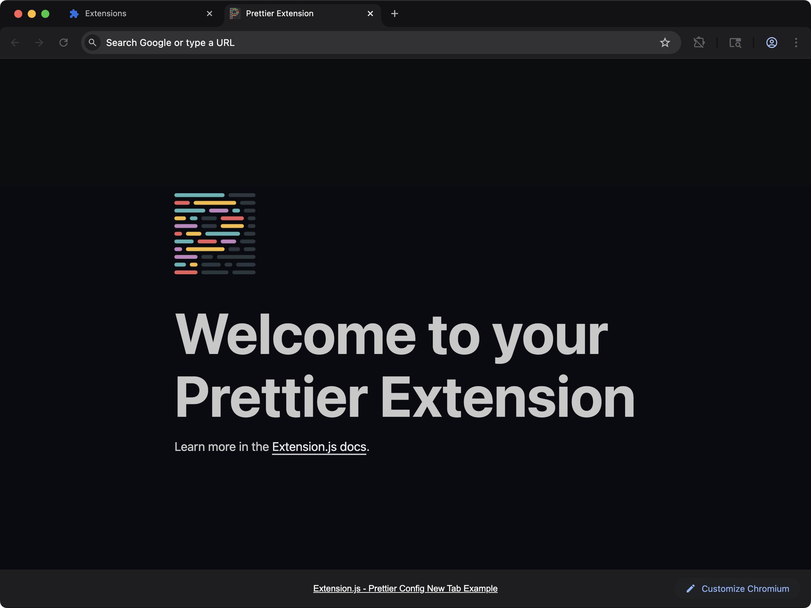</td>
    </tr>
    <tr><td>Version</td><td align="right">1.0.0</td></tr>
    <tr><td>Context</td><td align="right">New Tab, Background</td></tr>
    <tr><td>JavaScript framework</td><td align="right">JavaScript</td></tr>
    <tr><td>CSS</td><td align="right">CSS</td></tr>
    <tr>
      <td>Background included</td>
      <td align="right">Yes</td>
      <td align="center"><a href="https://templates.extension.dev/newtab-config-prettier">Start with this template &#8599;</a></td>
    </tr>
  </table>
</details>

<details>
  <summary> New Config Stylelint Example</summary>

> New tab page example with Stylelint configured. Shows how CSS linting is set up in an extension project.

  <table>
    <tr>
      <td>Repository</td>
      <td align="right"><a href="https://github.com/extension-js/examples/blob/main/examples/newtab-config-stylelint/README.md">examples/newtab-config-stylelint</a></td>
      <td rowspan="5">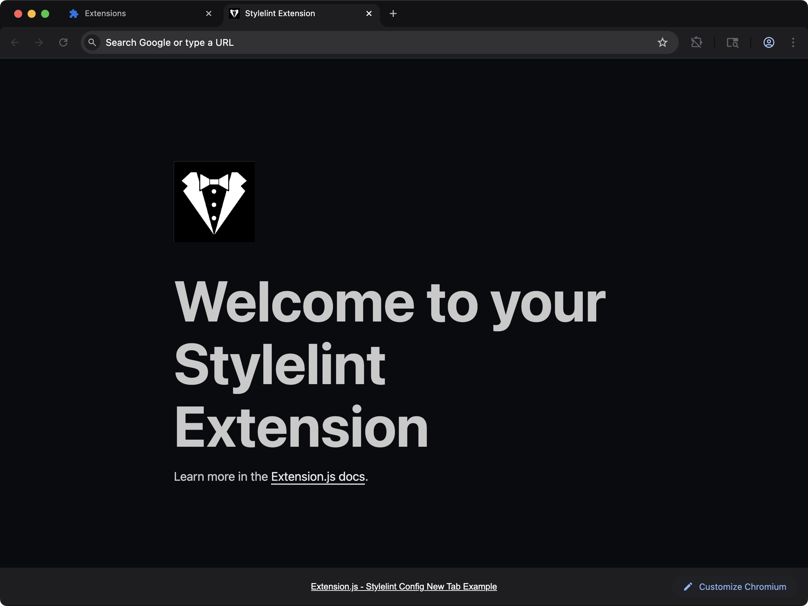</td>
    </tr>
    <tr><td>Version</td><td align="right">1.0.0</td></tr>
    <tr><td>Context</td><td align="right">New Tab, Background</td></tr>
    <tr><td>JavaScript framework</td><td align="right">JavaScript</td></tr>
    <tr><td>CSS</td><td align="right">Sass</td></tr>
    <tr>
      <td>Background included</td>
      <td align="right">Yes</td>
      <td align="center"><a href="https://templates.extension.dev/newtab-config-stylelint">Start with this template &#8599;</a></td>
    </tr>
  </table>
</details>

<details>
  <summary> New Crypto Example</summary>

> New tab page example demonstrating basic crypto operations inside an extension.

  <table>
    <tr>
      <td>Repository</td>
      <td align="right"><a href="https://github.com/extension-js/examples/blob/main/examples/newtab-crypto/README.md">examples/newtab-crypto</a></td>
      <td rowspan="5">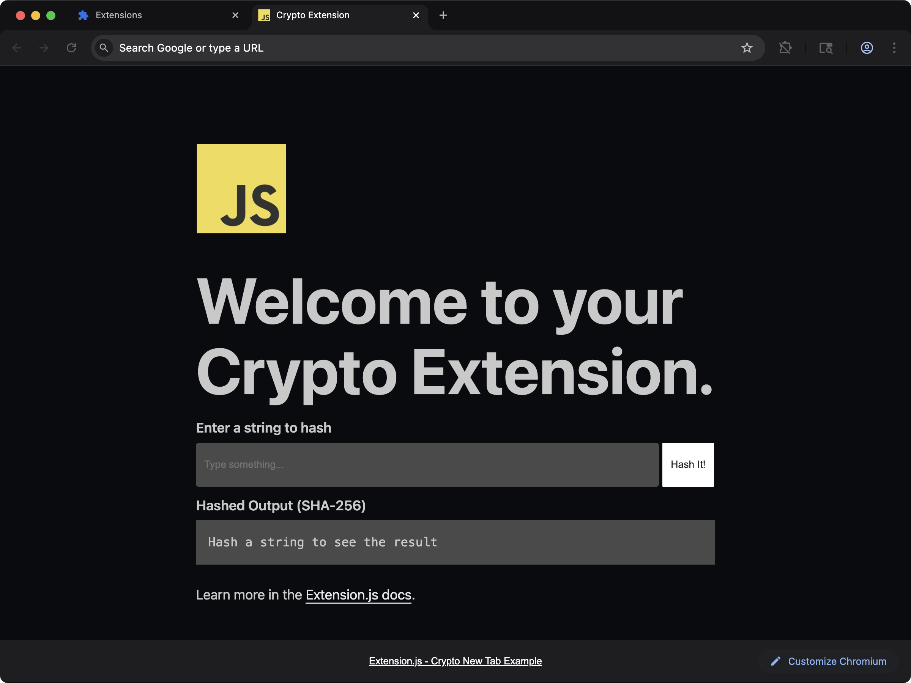</td>
    </tr>
    <tr><td>Version</td><td align="right">1.0.0</td></tr>
    <tr><td>Context</td><td align="right">New Tab, Background</td></tr>
    <tr><td>JavaScript framework</td><td align="right">JavaScript</td></tr>
    <tr><td>CSS</td><td align="right">CSS</td></tr>
    <tr>
      <td>Background included</td>
      <td align="right">Yes</td>
      <td align="center"><a href="https://templates.extension.dev/newtab-crypto">Start with this template &#8599;</a></td>
    </tr>
  </table>
</details>

<details>
  <summary>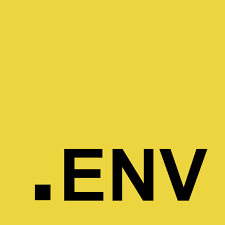 New Env Example</summary>

> New tab page example demonstrating environment variables (.env) in an extension project.

  <table>
    <tr>
      <td>Repository</td>
      <td align="right"><a href="https://github.com/extension-js/examples/blob/main/examples/newtab-env/README.md">examples/newtab-env</a></td>
      <td rowspan="5">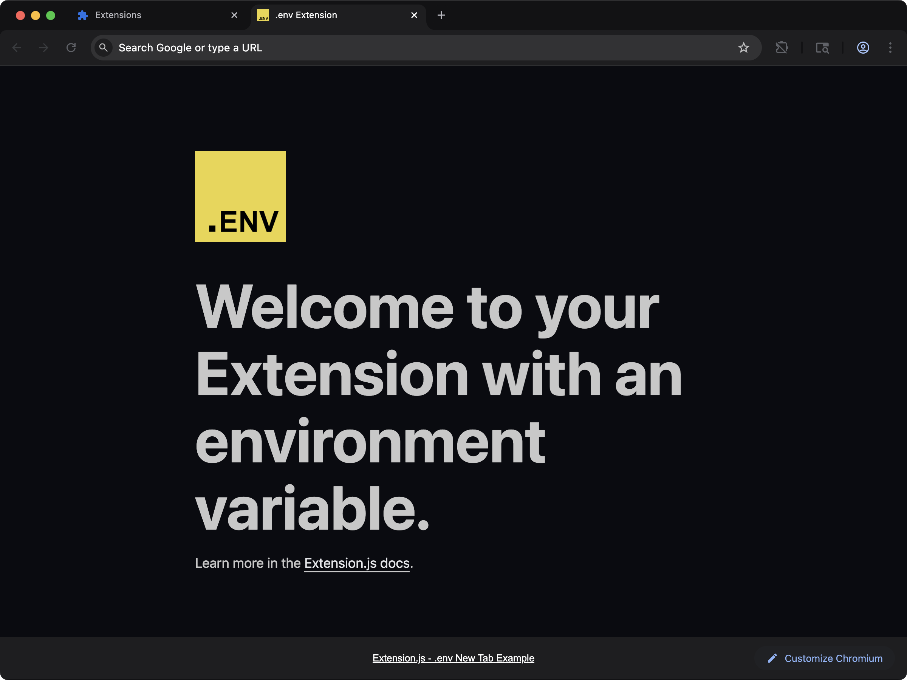</td>
    </tr>
    <tr><td>Version</td><td align="right">1.0.0</td></tr>
    <tr><td>Context</td><td align="right">New Tab, Background</td></tr>
    <tr><td>JavaScript framework</td><td align="right">JavaScript</td></tr>
    <tr><td>CSS</td><td align="right">CSS</td></tr>
    <tr>
      <td>Background included</td>
      <td align="right">Yes</td>
      <td align="center"><a href="https://templates.extension.dev/newtab-env">Start with this template &#8599;</a></td>
    </tr>
  </table>
</details>

<details>
  <summary> New Less Example</summary>

> New tab page example styled with Less. Renders a simple page and organizes styles with Less.

  <table>
    <tr>
      <td>Repository</td>
      <td align="right"><a href="https://github.com/extension-js/examples/blob/main/examples/newtab-less/README.md">examples/newtab-less</a></td>
      <td rowspan="5">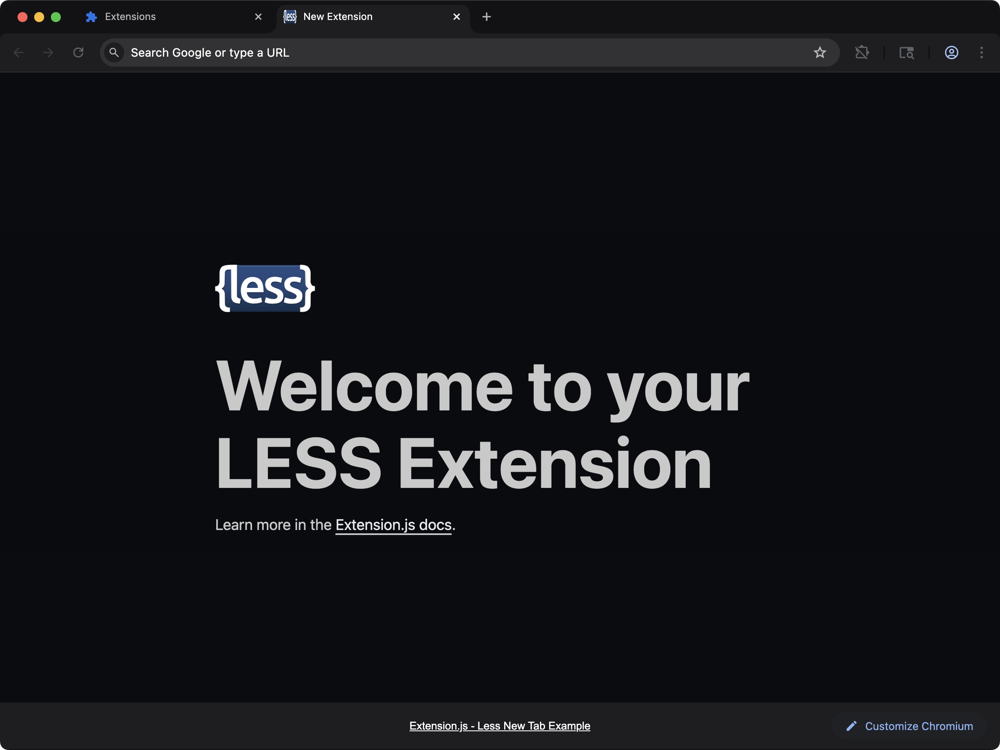</td>
    </tr>
    <tr><td>Version</td><td align="right">1.0.0</td></tr>
    <tr><td>Context</td><td align="right">New Tab, Background</td></tr>
    <tr><td>JavaScript framework</td><td align="right">JavaScript</td></tr>
    <tr><td>CSS</td><td align="right">Less</td></tr>
    <tr>
      <td>Background included</td>
      <td align="right">Yes</td>
      <td align="center"><a href="https://templates.extension.dev/newtab-less">Start with this template &#8599;</a></td>
    </tr>
  </table>
</details>

<details>
  <summary> New Preact Example</summary>

> New tab page example rendered with Preact. Loads a small Preact app you can extend.

  <table>
    <tr>
      <td>Repository</td>
      <td align="right"><a href="https://github.com/extension-js/examples/blob/main/examples/newtab-preact/README.md">examples/newtab-preact</a></td>
      <td rowspan="5">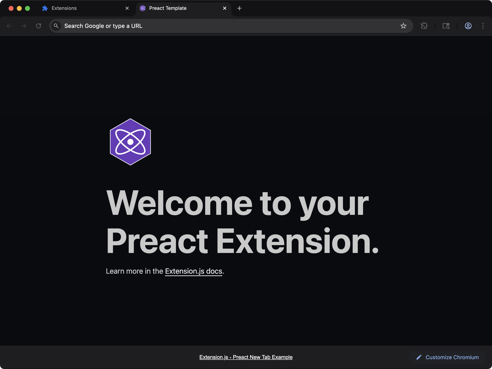</td>
    </tr>
    <tr><td>Version</td><td align="right">1.0.0</td></tr>
    <tr><td>Context</td><td align="right">New Tab, Background</td></tr>
    <tr><td>JavaScript framework</td><td align="right">Preact</td></tr>
    <tr><td>CSS</td><td align="right">CSS</td></tr>
    <tr>
      <td>Background included</td>
      <td align="right">Yes</td>
      <td align="center"><a href="https://templates.extension.dev/newtab-preact">Start with this template &#8599;</a></td>
    </tr>
  </table>
</details>

<details>
  <summary> New React Example</summary>

> A browser extension new tab page example built with Extension.js and React. Demonstrates a React-based new tab page with a working build and preview flow.

  <table>
    <tr>
      <td>Repository</td>
      <td align="right"><a href="https://github.com/extension-js/examples/blob/main/examples/newtab-react/README.md">examples/newtab-react</a></td>
      <td rowspan="5">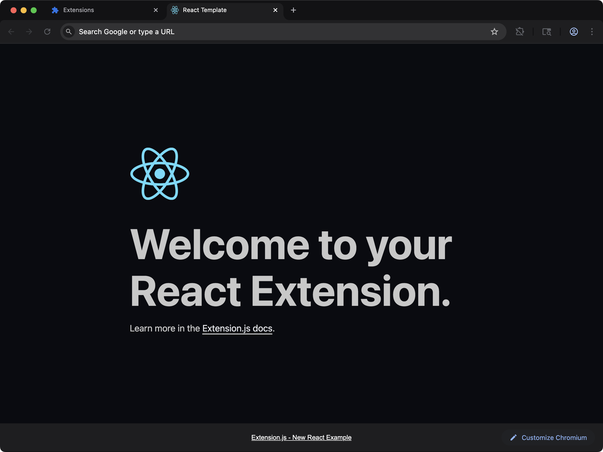</td>
    </tr>
    <tr><td>Version</td><td align="right">1.0.0</td></tr>
    <tr><td>Context</td><td align="right">New Tab, Background</td></tr>
    <tr><td>JavaScript framework</td><td align="right">React</td></tr>
    <tr><td>CSS</td><td align="right">CSS</td></tr>
    <tr>
      <td>Background included</td>
      <td align="right">Yes</td>
      <td align="center"><a href="https://templates.extension.dev/newtab-react">Start with this template &#8599;</a></td>
    </tr>
  </table>
</details>

<details>
  <summary> New React Router Example</summary>

> New tab page example using React Router. Shows multiple routes inside the new tab app.

  <table>
    <tr>
      <td>Repository</td>
      <td align="right"><a href="https://github.com/extension-js/examples/blob/main/examples/newtab-react-router/README.md">examples/newtab-react-router</a></td>
      <td rowspan="5">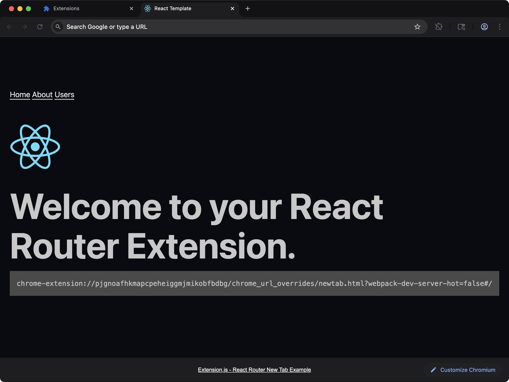</td>
    </tr>
    <tr><td>Version</td><td align="right">1.0.0</td></tr>
    <tr><td>Context</td><td align="right">New Tab, Background</td></tr>
    <tr><td>JavaScript framework</td><td align="right">React</td></tr>
    <tr><td>CSS</td><td align="right">CSS</td></tr>
    <tr>
      <td>Background included</td>
      <td align="right">Yes</td>
      <td align="center"><a href="https://templates.extension.dev/newtab-react-router">Start with this template &#8599;</a></td>
    </tr>
  </table>
</details>

<details>
  <summary> New Sass Example</summary>

> New tab page example styled with Sass. Renders a simple page and organizes styles with Sass.

  <table>
    <tr>
      <td>Repository</td>
      <td align="right"><a href="https://github.com/extension-js/examples/blob/main/examples/newtab-sass/README.md">examples/newtab-sass</a></td>
      <td rowspan="5">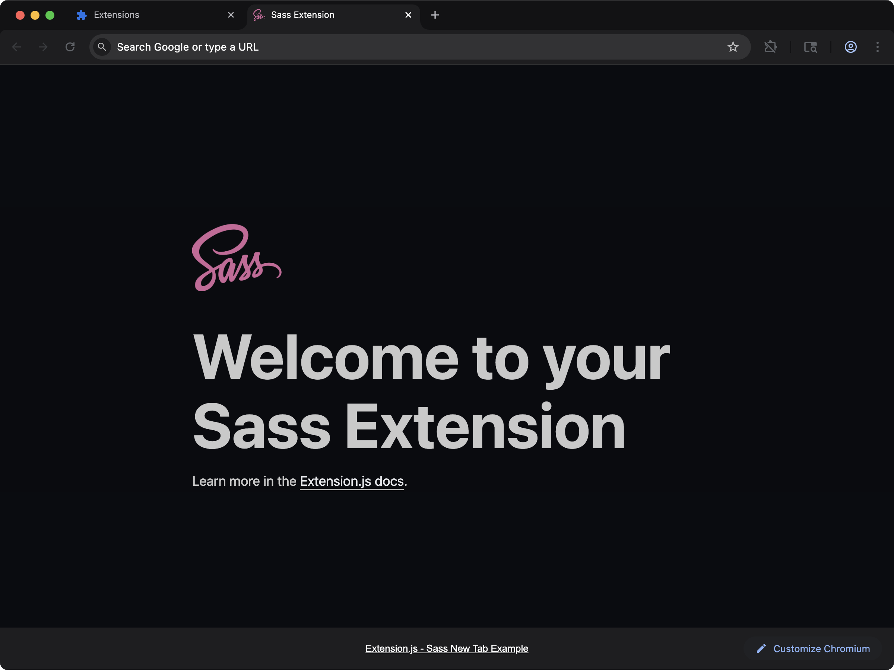</td>
    </tr>
    <tr><td>Version</td><td align="right">1.0.0</td></tr>
    <tr><td>Context</td><td align="right">New Tab, Background</td></tr>
    <tr><td>JavaScript framework</td><td align="right">JavaScript</td></tr>
    <tr><td>CSS</td><td align="right">Sass</td></tr>
    <tr>
      <td>Background included</td>
      <td align="right">Yes</td>
      <td align="center"><a href="https://templates.extension.dev/newtab-sass">Start with this template &#8599;</a></td>
    </tr>
  </table>
</details>

<details>
  <summary> New Svelte Example</summary>

> New tab page example rendered with Svelte. Loads a small Svelte app you can extend.

  <table>
    <tr>
      <td>Repository</td>
      <td align="right"><a href="https://github.com/extension-js/examples/blob/main/examples/newtab-svelte/README.md">examples/newtab-svelte</a></td>
      <td rowspan="5">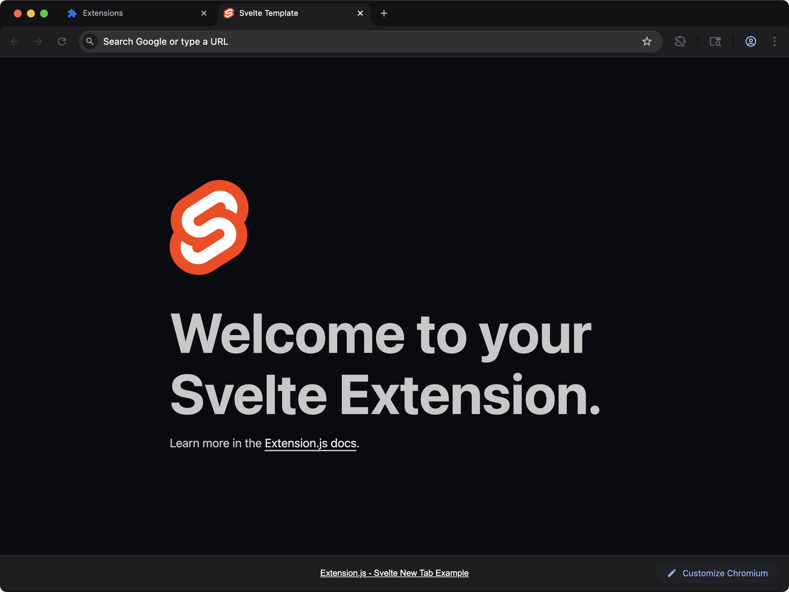</td>
    </tr>
    <tr><td>Version</td><td align="right">1.0.0</td></tr>
    <tr><td>Context</td><td align="right">New Tab, Background</td></tr>
    <tr><td>JavaScript framework</td><td align="right">Svelte</td></tr>
    <tr><td>CSS</td><td align="right">CSS</td></tr>
    <tr>
      <td>Background included</td>
      <td align="right">Yes</td>
      <td align="center"><a href="https://templates.extension.dev/newtab-svelte">Start with this template &#8599;</a></td>
    </tr>
  </table>
</details>

<details>
  <summary> New TypeScript Example</summary>

> A browser extension new tab page example built with Extension.js and TypeScript. Demonstrates a type-safe new tab page with a working build and preview flow.

  <table>
    <tr>
      <td>Repository</td>
      <td align="right"><a href="https://github.com/extension-js/examples/blob/main/examples/newtab-typescript/README.md">examples/newtab-typescript</a></td>
      <td rowspan="5">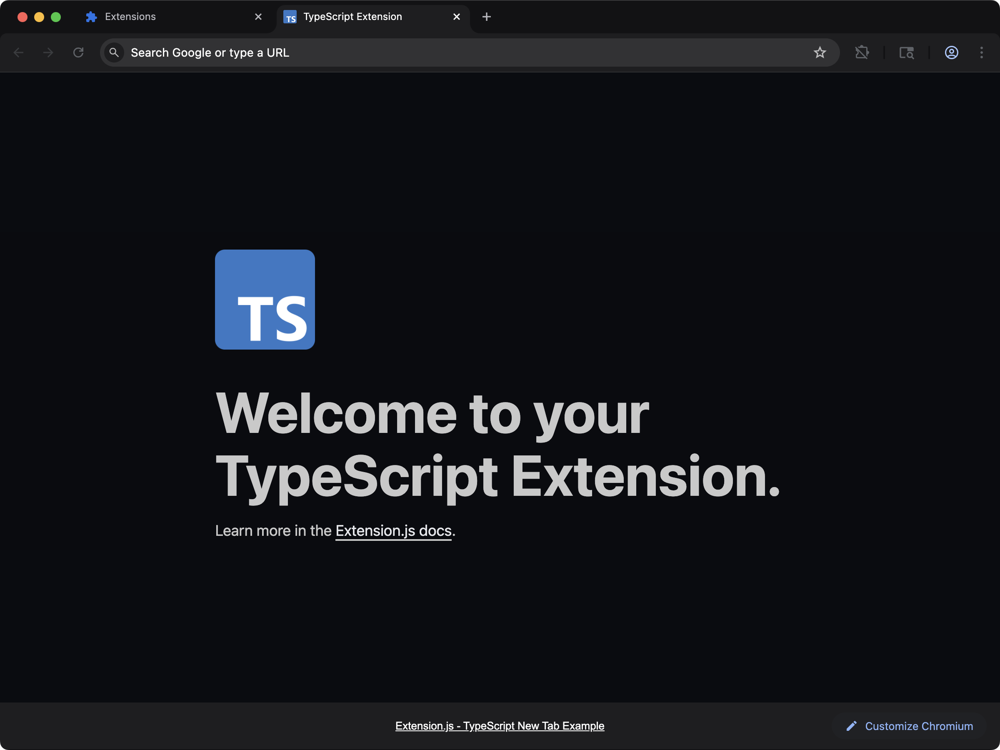</td>
    </tr>
    <tr><td>Version</td><td align="right">1.0.0</td></tr>
    <tr><td>Context</td><td align="right">New Tab, Background</td></tr>
    <tr><td>JavaScript framework</td><td align="right">JavaScript</td></tr>
    <tr><td>CSS</td><td align="right">CSS</td></tr>
    <tr>
      <td>Background included</td>
      <td align="right">Yes</td>
      <td align="center"><a href="https://templates.extension.dev/newtab-typescript">Start with this template &#8599;</a></td>
    </tr>
  </table>
</details>

<details>
  <summary> New Vue Example</summary>

> New tab page example rendered with Vue. Loads a small Vue app you can extend.

  <table>
    <tr>
      <td>Repository</td>
      <td align="right"><a href="https://github.com/extension-js/examples/blob/main/examples/newtab-vue/README.md">examples/newtab-vue</a></td>
      <td rowspan="5">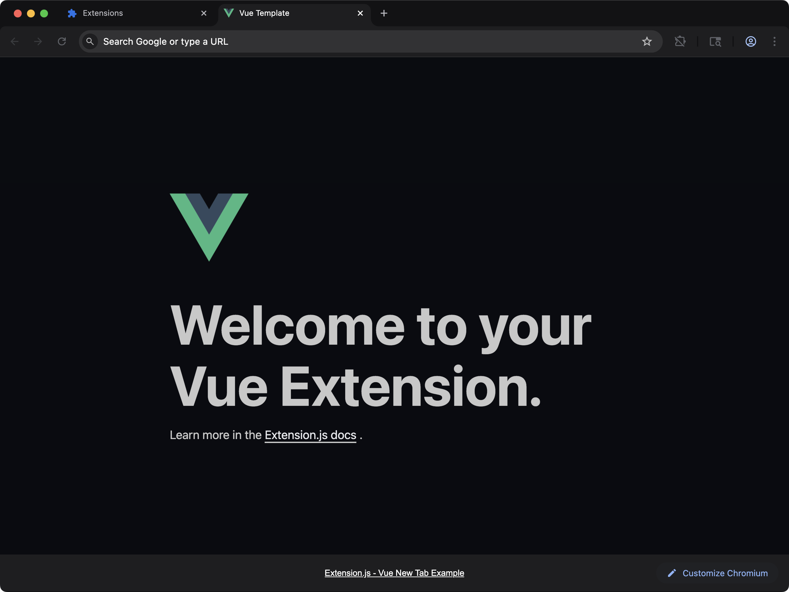</td>
    </tr>
    <tr><td>Version</td><td align="right">1.0.0</td></tr>
    <tr><td>Context</td><td align="right">New Tab, Background</td></tr>
    <tr><td>JavaScript framework</td><td align="right">Vue</td></tr>
    <tr><td>CSS</td><td align="right">CSS</td></tr>
    <tr>
      <td>Background included</td>
      <td align="right">Yes</td>
      <td align="center"><a href="https://templates.extension.dev/newtab-vue">Start with this template &#8599;</a></td>
    </tr>
  </table>
</details>

### Special folders

<details>
  <summary> Special Folders Pages Example</summary>

> Opens a welcome page on extension load, showcasing the pages/ folder.

  <table>
    <tr>
      <td>Repository</td>
      <td align="right"><a href="https://github.com/extension-js/examples/blob/main/examples/special-folders-pages/README.md">examples/special-folders-pages</a></td>
      <td rowspan="5">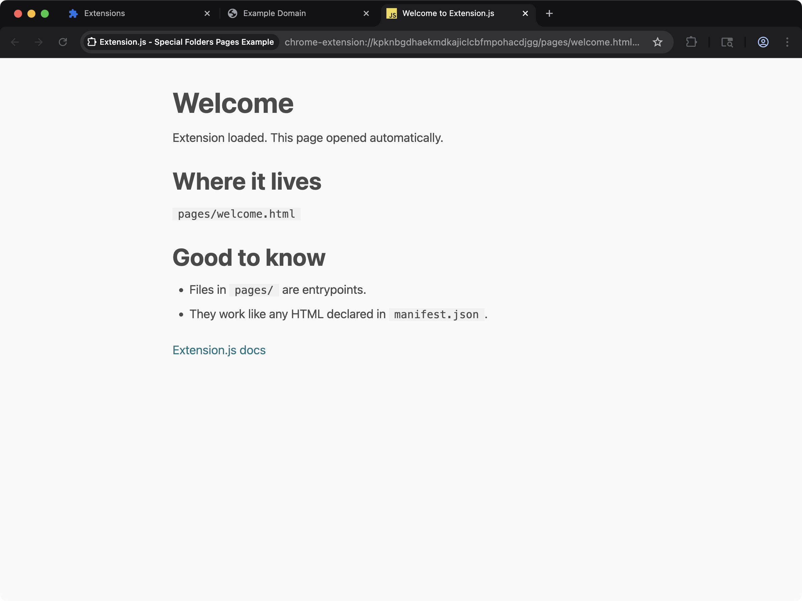</td>
    </tr>
    <tr><td>Version</td><td align="right">1.0.0</td></tr>
    <tr><td>Context</td><td align="right">Background</td></tr>
    <tr><td>JavaScript framework</td><td align="right">JavaScript</td></tr>
    <tr><td>CSS</td><td align="right">CSS</td></tr>
    <tr>
      <td>Background included</td>
      <td align="right">Yes</td>
      <td align="center"><a href="https://templates.extension.dev/special-folders-pages">Start with this template &#8599;</a></td>
    </tr>
  </table>
</details>

<details>
  <summary> Special Folders Scripts Example</summary>

> Demonstrates scripts/ folder organization and how to run standalone scripts via the extension.

  <table>
    <tr>
      <td>Repository</td>
      <td align="right"><a href="https://github.com/extension-js/examples/blob/main/examples/special-folders-scripts/README.md">examples/special-folders-scripts</a></td>
      <td rowspan="5">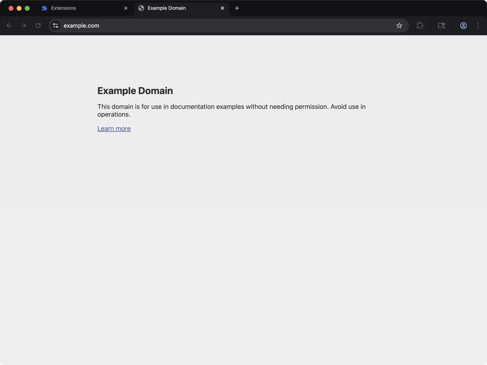</td>
    </tr>
    <tr><td>Version</td><td align="right">1.0.0</td></tr>
    <tr><td>Context</td><td align="right">Background</td></tr>
    <tr><td>JavaScript framework</td><td align="right">JavaScript</td></tr>
    <tr><td>CSS</td><td align="right">CSS</td></tr>
    <tr>
      <td>Background included</td>
      <td align="right">Yes</td>
      <td align="center"><a href="https://templates.extension.dev/special-folders-scripts">Start with this template &#8599;</a></td>
    </tr>
  </table>
</details>

### Utilities

<details>
  <summary> Init Example</summary>

> A basic browser extension example built with Extension.js. A starting point for developers learning current browser extension tooling.

  <table>
    <tr>
      <td>Repository</td>
      <td align="right"><a href="https://github.com/extension-js/examples/blob/main/examples/init/README.md">examples/init</a></td>
      <td rowspan="5">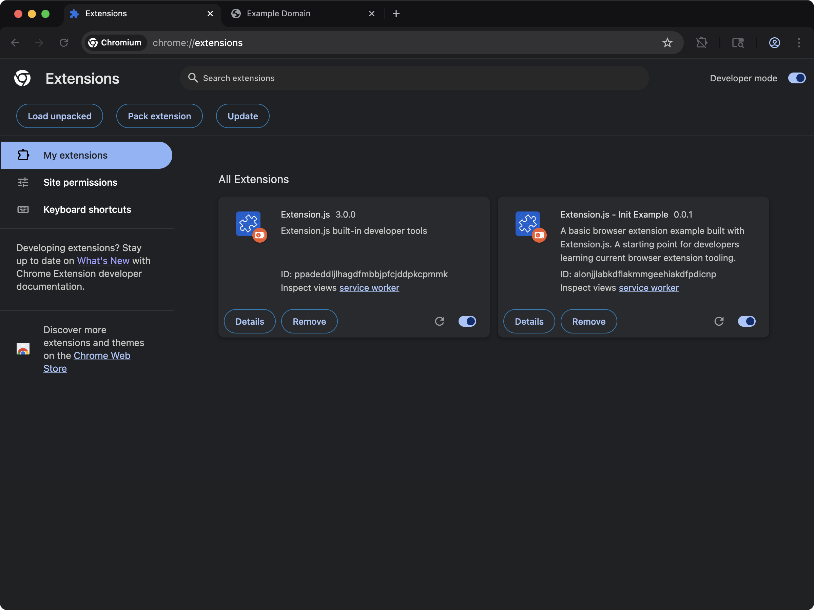</td>
    </tr>
    <tr><td>Version</td><td align="right">1.0.0</td></tr>
    <tr><td>Context</td><td align="right"></td></tr>
    <tr><td>JavaScript framework</td><td align="right">JavaScript</td></tr>
    <tr><td>CSS</td><td align="right">CSS</td></tr>
    <tr>
      <td>Background included</td>
      <td align="right">No</td>
      <td align="center"><a href="https://templates.extension.dev/init">Start with this template &#8599;</a></td>
    </tr>
  </table>
</details>

## License

MIT (c) Cezar Augusto and the Extension.js authors.
