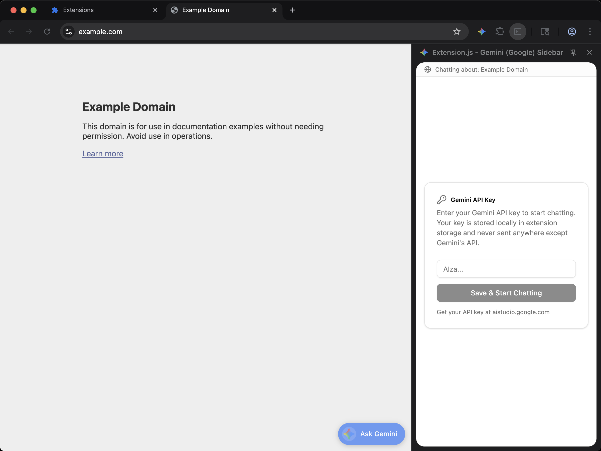

[powered-image]: https://img.shields.io/badge/Powered%20by-Extension.js-0971fe
[powered-url]: https://extension.js.org

![Powered by Extension.js][powered-image]

# AI Sidebar (Gemini / Google) Example

> Adds a sidebar panel where you can chat with Gemini about the page you are viewing.



**What you'll see**: A small React UI injected into any web page, isolated in a Shadow DOM so site styles don't bleed through.

**How it works**: A content script mounts a React + TypeScript UI inside a Shadow DOM and applies scoped styles so the host page can't bleed through. Styles flow through Tailwind + PostCSS. UI is composed with Radix / shadcn primitives, lucide-react.

Conversational sidebar wired to the [Google Generative AI SDK](https://ai.google.dev/gemini-api/docs). Paste a Google AI Studio key the first time you open the panel (it lives in `chrome.storage.local` and never leaves the device) and chat with Gemini inline next to whatever page you're on. Shares its layout and shadcn/ui primitives with the `ai-claude`, `ai-chatgpt`, and `ai-perplexity` siblings; only the SDK and brand accent change.

## Try it locally

```bash
npx extension@latest create my-ai-gemini --template ai-gemini
cd my-ai-gemini
npm install
npm run dev
```

A fresh browser window opens with the extension already loaded.

## Project layout

```
src/
├── components/
│   ├── ui/
│   │   ├── button.tsx
│   │   ├── card.tsx
│   │   └── scroll-area.tsx
│   ├── ApiKeyForm.tsx
│   ├── ChatInput.tsx
│   └── ChatMessage.tsx
├── content/
│   ├── ContentApp.ts
│   ├── scripts.ts
│   └── styles.css
├── images/
│   └── icon.png
├── lib/
│   ├── client.ts
│   ├── page-context.ts
│   └── utils.ts
├── sidebar/
│   ├── index.html
│   ├── scripts.tsx
│   ├── SidebarApp.tsx
│   └── styles.css
├── background.ts
└── manifest.json
```

## Commands

Cloned this repo instead? The examples ship without npm scripts, so run Extension.js directly from the example directory. Run `npm install` first when the example declares dependencies.

### dev

Run the extension in development mode. Target a browser with `--browser`:

```bash
npx extension@latest dev .                  # Chromium (default)
npx extension@latest dev . --browser=chrome
npx extension@latest dev . --browser=edge
npx extension@latest dev . --browser=firefox
```

### build

Build for production:

```bash
npx extension@latest build .                # Chromium (default)
npx extension@latest build . --browser=firefox
npx extension@latest build . --browser=edge
```

### preview

Preview the production build with the bundled browser:

```bash
npx extension@latest preview .
```

## Tests

This template ships an end-to-end check (`template.spec.ts`) validated by the examples-repo CI on every commit.

## Learn more

- [Extension.js docs](https://extension.js.org)
- [Templates index](https://extension.js.org/docs/getting-started/templates)
- [GitHub: extension-js/extension.js](https://github.com/extension-js/extension.js)
