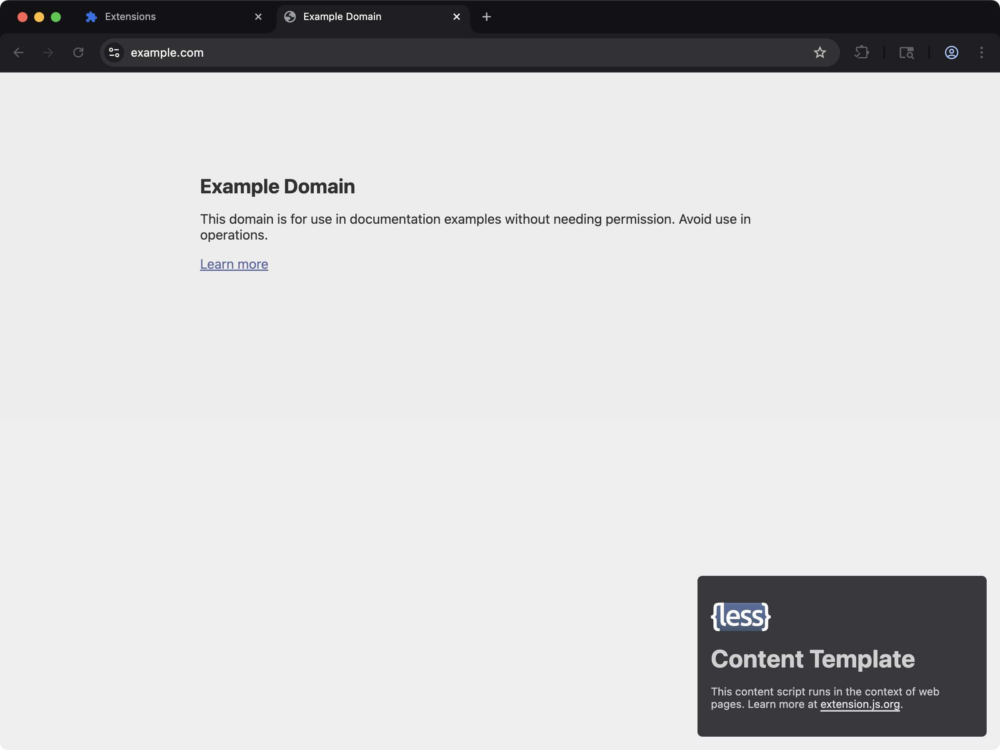

[powered-image]: https://img.shields.io/badge/Powered%20by-Extension.js-0971fe
[powered-url]: https://extension.js.org

![Powered by Extension.js][powered-image]

# JavaScript Content Script Example

> Injects a small styled badge into every web page, with a Less options page that turns it off.



**What you'll see**: A small UI injected into any web page, isolated in a Shadow DOM so site styles don't bleed through. The badge carries an **Open options** button, and the options page behind it has one checkbox that hides or shows the badge live.

**How it works**: A content script mounts a JavaScript UI inside a Shadow DOM and applies scoped styles so the host page can't bleed through. Styles flow through Less.

The template ships two more surfaces on top of that badge. The manifest registers an `options_ui` page bundled from `src/options/`, styled with Less as well, so both surfaces run through the same pipeline. The page reads the `showBadge` setting with `chrome.storage.sync.get` on load and writes it back with `chrome.storage.sync.set` on change. The content script reads the same key on injection and subscribes to `chrome.storage.onChanged`, so ticking the box updates every open page without a reload. The subscription is removed in the cleanup function the framework calls, next to the badge teardown.

A content script cannot open the options page itself, because `chrome.runtime.openOptionsPage` lives on the extension side. The **Open options** button sends `{type: 'open-options'}` to the background script, and the background script opens the page.

## Try it locally

```bash
npx extension@latest create my-content-less --template content-less
cd my-content-less
npm install
npm run dev
```

A fresh browser window opens with the extension already loaded.

## Project layout

```
src/
├── content/
│   ├── scripts.js
│   └── styles.less
├── images/
│   └── icon.png
├── options/
│   ├── index.html
│   ├── scripts.js
│   └── styles.less
├── background.js
└── manifest.json
```

## Commands

Cloned this repo instead? The examples ship without npm scripts, so run Extension.js directly from the example directory. Run `npm install` first when the example declares dependencies.

### dev

Run the extension in development mode. Target a browser with `--browser`:

```bash
npx extension@latest dev .                  # Chromium (default)
npx extension@latest dev . --browser=chrome
npx extension@latest dev . --browser=edge
npx extension@latest dev . --browser=firefox
```

### build

Build for production:

```bash
npx extension@latest build .                # Chromium (default)
npx extension@latest build . --browser=firefox
npx extension@latest build . --browser=edge
```

### preview

Preview the production build with the bundled browser:

```bash
npx extension@latest preview .
```

## Tests

This template ships an end-to-end check (`template.spec.ts`) validated by the examples-repo CI on every commit.

## Learn more

- [Extension.js docs](https://extension.js.org)
- [Templates index](https://extension.js.org/docs/getting-started/templates)
- [GitHub: extension-js/extension.js](https://github.com/extension-js/extension.js)
