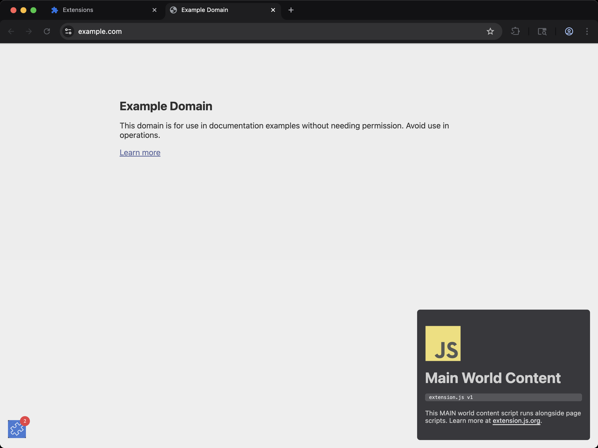

[powered-image]: https://img.shields.io/badge/Powered%20by-Extension.js-0971fe
[powered-url]: https://extension.js.org

![Powered by Extension.js][powered-image]

# Content Script in MAIN World Example

> Injects a small UI from the page's own JavaScript world, with an options page that turns it off.



**What you'll see**: A small UI injected into any web page, isolated in a Shadow DOM so site styles don't bleed through. The UI carries an **Open options** button, and the options page behind it has one checkbox that hides or shows the UI live.

**How it works**: A content script mounts a JavaScript UI inside a Shadow DOM and applies scoped styles so the host page can't bleed through.

Loads the content script in the page's **MAIN world** (Chromium-only). Useful when your script needs direct access to page-side globals or classes that the isolated world cannot reach. Firefox does not support MAIN-world content scripts, so this template is gated to Chromium targets.

### The options page needs an isolated world companion

A MAIN world script runs in the page's own JavaScript context, so it has no `chrome.runtime` and no `chrome.storage`. It cannot message the background script and it cannot read the setting. `src/content/isolated-options.js` is a second content script, registered without a `world` key so it runs in the isolated world, and it owns both jobs on behalf of the UI.

- Clicking **Open options** posts `{source: 'content-main-world', type: 'open-options'}` on the shared `window`. The companion hears it, sends `{type: 'open-options'}` to the background script, and the background script calls `chrome.runtime.openOptionsPage`.
- The companion reads the `showBadge` setting with `chrome.storage.sync.get` and posts the value back to the MAIN world, which hides or shows the UI. It also subscribes to `chrome.storage.onChanged` and posts every later value, so ticking the box on the options page updates every open page without a reload.
- Either half can load first, so the companion publishes on load and the MAIN world script asks for the value once its listener is attached. One of the two always lands.
- Both halves remove their listeners in the cleanup function the framework calls.

The window the two halves share is the page's window, so the page can read these messages and post its own. Keep the payloads trivial and relay nothing a page should not be able to trigger.

The framework leans on the same fact: the build injects its own isolated world bridge script next to your entries, because the MAIN world bundle needs `chrome.runtime.getURL` to resolve extension URLs.

## Try it locally

```bash
npx extension@latest create my-content-main-world --template content-main-world
cd my-content-main-world
npm install
npm run dev
```

A fresh browser window opens with the extension already loaded.

## Project layout

```
src/
├── content/
│   ├── utils/
│   │   ├── constants.js
│   │   └── create-badge.js
│   ├── isolated-one.js
│   ├── isolated-options.js
│   ├── isolated-two.js
│   ├── scripts.js
│   └── styles.css
├── images/
│   └── icon.png
├── options/
│   ├── index.html
│   ├── scripts.js
│   └── styles.css
├── background.js
└── manifest.json
```

## Commands

Cloned this repo instead? The examples ship without npm scripts, so run Extension.js directly from the example directory. Run `npm install` first when the example declares dependencies.

### dev

Run the extension in development mode. Target a browser with `--browser`:

```bash
npx extension@latest dev .                  # Chromium (default)
npx extension@latest dev . --browser=chrome
npx extension@latest dev . --browser=edge
npx extension@latest dev . --browser=firefox
```

### build

Build for production:

```bash
npx extension@latest build .                # Chromium (default)
npx extension@latest build . --browser=firefox
npx extension@latest build . --browser=edge
```

### preview

Preview the production build with the bundled browser:

```bash
npx extension@latest preview .
```

## Tests

This template ships an end-to-end check (`template.spec.ts`) validated by the examples-repo CI on every commit.

## Learn more

- [Extension.js docs](https://extension.js.org)
- [Templates index](https://extension.js.org/docs/getting-started/templates)
- [GitHub: extension-js/extension.js](https://github.com/extension-js/extension.js)
