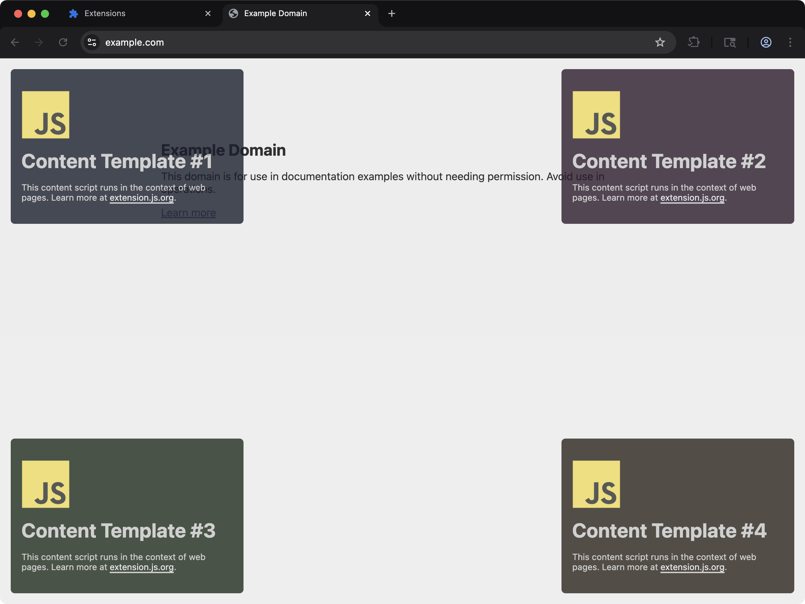

[powered-image]: https://img.shields.io/badge/Powered%20by-Extension.js-0971fe
[powered-url]: https://extension.js.org

![Powered by Extension.js][powered-image]

# JavaScript Content Script Example

> Injects four small elements into every web page you visit, with an options page that hides the first one.



**What you'll see**: Four small UIs injected into any web page, one per corner, each isolated in a Shadow DOM so site styles don't bleed through. The top-left one carries an **Open options** button, and the options page behind it has one checkbox that hides or shows that element live.

**How it works**: A content script mounts a JavaScript UI inside a Shadow DOM and applies scoped styles so the host page can't bleed through.

A single content-script entry that targets multiple URL patterns declared in `manifest.json#content_scripts`. All four scripts sit in that one entry, so they ship as one bundle.

The template also registers an `options_ui` page bundled from `src/options/`. The page reads the `showBadge` setting with `chrome.storage.sync.get` on load and writes it back with `chrome.storage.sync.set` on change. Only `script-top-left.js` reads that key and subscribes to `chrome.storage.onChanged`, so ticking the box hides or shows Content Template #1 without a reload. It removes the listener in the cleanup function Extension.js calls on teardown.

The button lives in the top-left element alone. Four copies of the same button would say nothing about what this template demonstrates, which is how many entries the manifest declares.

A content script cannot open the options page itself, because `chrome.runtime.openOptionsPage` lives on the extension side. The button sends `{type: 'open-options'}` to the background script, and the background script opens the page.

## Try it locally

```bash
npx extension@latest create my-content-multi-one-entry --template content-multi-one-entry
cd my-content-multi-one-entry
npm install
npm run dev
```

A fresh browser window opens with the extension already loaded.

## Project layout

```
src/
├── content/
│   ├── utils/
│   │   ├── constants.js
│   │   └── create-badge.js
│   ├── script-bottom-left.js
│   ├── script-bottom-right.js
│   ├── script-top-left.js
│   ├── script-top-right.js
│   └── styles.css
├── images/
│   └── icon.png
├── options/
│   ├── index.html
│   ├── scripts.js
│   └── styles.css
├── background.js
└── manifest.json
```

## Commands

Cloned this repo instead? The examples ship without npm scripts, so run Extension.js directly from the example directory. Run `npm install` first when the example declares dependencies.

### dev

Run the extension in development mode. Target a browser with `--browser`:

```bash
npx extension@latest dev .                  # Chromium (default)
npx extension@latest dev . --browser=chrome
npx extension@latest dev . --browser=edge
npx extension@latest dev . --browser=firefox
```

### build

Build for production:

```bash
npx extension@latest build .                # Chromium (default)
npx extension@latest build . --browser=firefox
npx extension@latest build . --browser=edge
```

### preview

Preview the production build with the bundled browser:

```bash
npx extension@latest preview .
```

## Tests

This template ships an end-to-end check (`template.spec.ts`) validated by the examples-repo CI on every commit.

## Learn more

- [Extension.js docs](https://extension.js.org)
- [Templates index](https://extension.js.org/docs/getting-started/templates)
- [GitHub: extension-js/extension.js](https://github.com/extension-js/extension.js)
