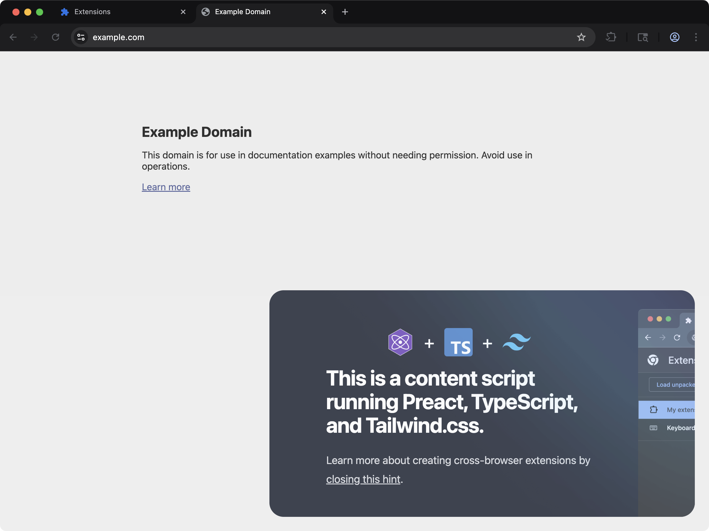

[powered-image]: https://img.shields.io/badge/Powered%20by-Extension.js-0971fe
[powered-url]: https://extension.js.org

![Powered by Extension.js][powered-image]

# Preact Content Script Example

> Shows an overlay UI on web pages and an options page that saves one setting.



**What you'll see**: A small Preact UI injected into any web page, isolated in a Shadow DOM so site styles don't bleed through. It carries an **Open options** button, and the options page behind it has one checkbox that hides and shows the overlay live.

**How it works**: A content script mounts a Preact + TypeScript UI inside a Shadow DOM and applies scoped styles so the host page can't bleed through. Styles flow through Tailwind.

The manifest also registers an `options_ui` page bundled from `src/options/`, a second Preact app. It reads and writes one setting, `showBadge`, through `chrome.storage.sync`, which is why the manifest asks for the `storage` permission. The content script reads the same key on load and subscribes to `chrome.storage.onChanged`, so unticking the checkbox removes the overlay from every open page without a reload. That listener is removed in the cleanup function the framework calls on teardown.

A content script cannot open the options page on its own, because `chrome.runtime.openOptionsPage` lives on the extension side. The **Open options** button sends a message to the background worker, and the worker opens the page. With the overlay hidden, the options page is still reachable from the extension's entry in the browser's extensions page.

## Try it locally

```bash
npx extension@latest create my-content-preact --template content-preact
cd my-content-preact
npm install
npm run dev
```

A fresh browser window opens with the extension already loaded.

## Project layout

```
src/
├── content/
│   ├── ContentApp.tsx
│   ├── scripts.tsx
│   └── styles.css
├── images/
│   ├── chromeWindow.png
│   ├── icon.png
│   ├── preact.png
│   ├── tailwind_bg.png
│   ├── tailwind.png
│   └── typescript.png
├── options/
│   ├── OptionsApp.tsx
│   ├── index.html
│   ├── scripts.tsx
│   └── styles.css
├── background.ts
└── manifest.json
```

## Commands

Cloned this repo instead? The examples ship without npm scripts, so run Extension.js directly from the example directory. Run `npm install` first when the example declares dependencies.

### dev

Run the extension in development mode. Target a browser with `--browser`:

```bash
npx extension@latest dev .                  # Chromium (default)
npx extension@latest dev . --browser=chrome
npx extension@latest dev . --browser=edge
npx extension@latest dev . --browser=firefox
```

### build

Build for production:

```bash
npx extension@latest build .                # Chromium (default)
npx extension@latest build . --browser=firefox
npx extension@latest build . --browser=edge
```

### preview

Preview the production build with the bundled browser:

```bash
npx extension@latest preview .
```

## Tests

This template ships an end-to-end check (`template.spec.ts`) validated by the examples-repo CI on every commit.

## Learn more

- [Extension.js docs](https://extension.js.org)
- [Templates index](https://extension.js.org/docs/getting-started/templates)
- [GitHub: extension-js/extension.js](https://github.com/extension-js/extension.js)
