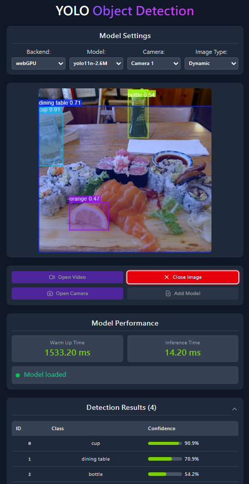

[powered-image]: https://img.shields.io/badge/Powered%20by-Extension.js-0971fe
[powered-url]: https://extension.js.org

![Powered by Extension.js][powered-image]

# React Sidebar Example

> Replaces your new tab page with a page that detects objects in an image, a video, or the camera.



**What you'll see**: A browser side panel that loads when you open the sidebar.

**How it works**: The manifest registers a side panel (`chromium:side_panel` / `firefox:sidebar_action`) that loads a React page bundled from `src/sidebar/`. Styles flow through Tailwind.

Detects objects in a photo, an MP4 file, or the camera with [onnxruntime-web](https://onnxruntime.ai/docs/tutorials/web/) and a bundled YOLO11n model. The wasm runtime and the model are copied into the extension at build time, so a new tab does not fetch them. The weights are Ultralytics YOLO11n under AGPL-3.0 (`src/newtab/models/LICENSE.txt`); the example code stays MIT. A local `.onnx` file can be added from the page if you want a different detector.

## Try it locally

```bash
npx extension@latest create my-newtab-react-onnxruntime --template newtab-react-onnxruntime
cd my-newtab-react-onnxruntime
npm install
npm run dev
```

A fresh browser window opens with the extension already loaded.

## Project layout

```
src/
├── images/
│   └── icon.png
├── newtab/
│   ├── assets/
│   │   ├── App.css
│   │   └── index.css
│   ├── components/
│   │   ├── ControlButtons.jsx
│   │   ├── ImageDisplay.jsx
│   │   ├── ModelStatus.jsx
│   │   ├── ResultsTable.jsx
│   │   └── SettingsPanel.jsx
│   ├── hooks/
│   │   ├── useInferenceWorker.js
│   │   ├── useVideoProcessWorker.js
│   │   └── useWebcam.js
│   ├── models/
│   │   ├── LICENSE.txt
│   │   └── yolo11n-detect.onnx
│   ├── utils/
│   │   ├── demuxer.js
│   │   ├── img-preprocess.js
│   │   ├── inference-pipeline-worker.js
│   │   ├── inference-pipeline.js
│   │   ├── model-loader.js
│   │   ├── ort-env.js
│   │   ├── render-overlay.js
│   │   ├── video_process_worker.js
│   │   └── yolo_classes.json
│   ├── App.jsx
│   ├── index.html
│   └── scripts.jsx
├── sidebar/
│   ├── index.html
│   ├── scripts.js
│   └── styles.css
├── background.js
├── last-detection.js
└── manifest.json
```

## Commands

Cloned this repo instead? The examples ship without npm scripts, so run Extension.js directly from the example directory. Run `npm install` first when the example declares dependencies.

### dev

Run the extension in development mode. Target a browser with `--browser`:

```bash
npx extension@latest dev .                  # Chromium (default)
npx extension@latest dev . --browser=chrome
npx extension@latest dev . --browser=edge
npx extension@latest dev . --browser=firefox
```

### build

Build for production:

```bash
npx extension@latest build .                # Chromium (default)
npx extension@latest build . --browser=firefox
npx extension@latest build . --browser=edge
```

### preview

Preview the production build with the bundled browser:

```bash
npx extension@latest preview .
```

## Tests

This template ships an end-to-end check (`template.spec.ts`) validated by the examples-repo CI on every commit.

## Learn more

- [Extension.js docs](https://extension.js.org)
- [Templates index](https://extension.js.org/docs/getting-started/templates)
- [GitHub: extension-js/extension.js](https://github.com/extension-js/extension.js)
