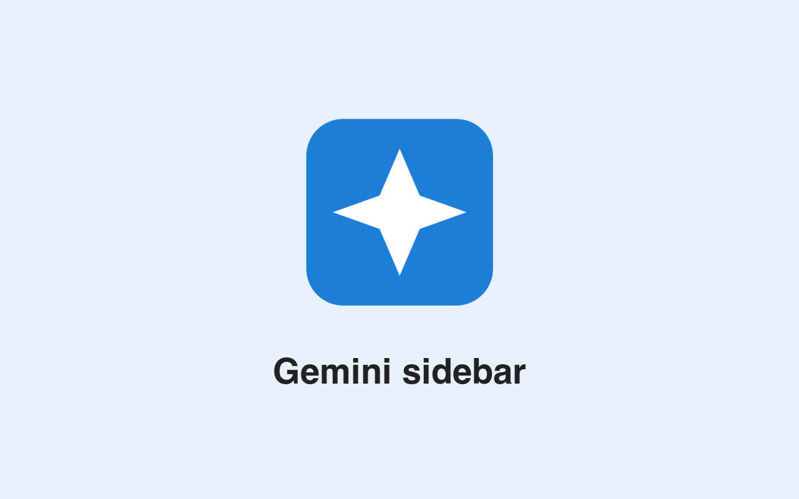

[powered-image]: https://img.shields.io/badge/Powered%20by-Extension.js-0971fe
[powered-url]: https://extension.js.org

![Powered by Extension.js][powered-image]

# AI Sidebar (Gemini / Google) Example

> React sidebar with Gemini chat. Adds a side panel with a conversational interface powered by the Google Generative AI SDK.



**What you'll see**: A browser side panel that loads when you open the sidebar.

**How it works**: The manifest registers a side panel (`chromium:side_panel` / `firefox:sidebar_action`) that loads a React + TypeScript page bundled from `src/sidebar/`. Styles flow through Tailwind + PostCSS. UI is composed with Radix / shadcn primitives, lucide-react.

Conversational sidebar wired to the [Google Generative AI SDK](https://ai.google.dev/gemini-api/docs). Paste a Google AI Studio key the first time you open the panel — it lives in `chrome.storage.local`, never leaves the device — and chat with Gemini inline next to whatever page you're on. Shares its layout and shadcn/ui primitives with the `sidebar-claude`, `sidebar-chatgpt`, and `sidebar-perplexity` siblings; only the SDK and brand accent change.

## Try it locally

```bash
npx extension@latest create my-sidebar-gemini --template sidebar-gemini
cd my-sidebar-gemini
npm install
npm run dev
```

A fresh browser window opens with the extension already loaded.

## Project layout

```
src/
├── components/
│   ├── ui/
│   │   ├── button.tsx
│   │   ├── card.tsx
│   │   └── scroll-area.tsx
│   ├── ApiKeyForm.tsx
│   ├── ChatInput.tsx
│   └── ChatMessage.tsx
├── images/
│   └── icon.png
├── lib/
│   ├── client.ts
│   └── utils.ts
├── sidebar/
│   ├── index.html
│   ├── scripts.tsx
│   ├── SidebarApp.tsx
│   └── styles.css
├── background.ts
└── manifest.json
```

## Commands

### dev

Run the extension in development mode. Target a browser with `--browser`:

```bash
npm run dev                 # Chromium (default)
npm run dev -- --browser=chrome
npm run dev -- --browser=edge
npm run dev -- --browser=firefox
```

### build

Build for production. Convenience scripts cover each browser:

```bash
npm run build           # Chrome (default)
npm run build:firefox
npm run build:edge
```

### preview

Preview the production build with the bundled browser:

```bash
npm run preview
```

## Tests

This template ships an end-to-end check (`template.spec.ts`) validated by the examples-repo CI on every commit.

## Learn more

- [Extension.js docs](https://extension.js.org)
- [Templates index](https://extension.js.org/docs/getting-started/templates)
- [GitHub: extension-js/extension.js](https://github.com/extension-js/extension.js)
