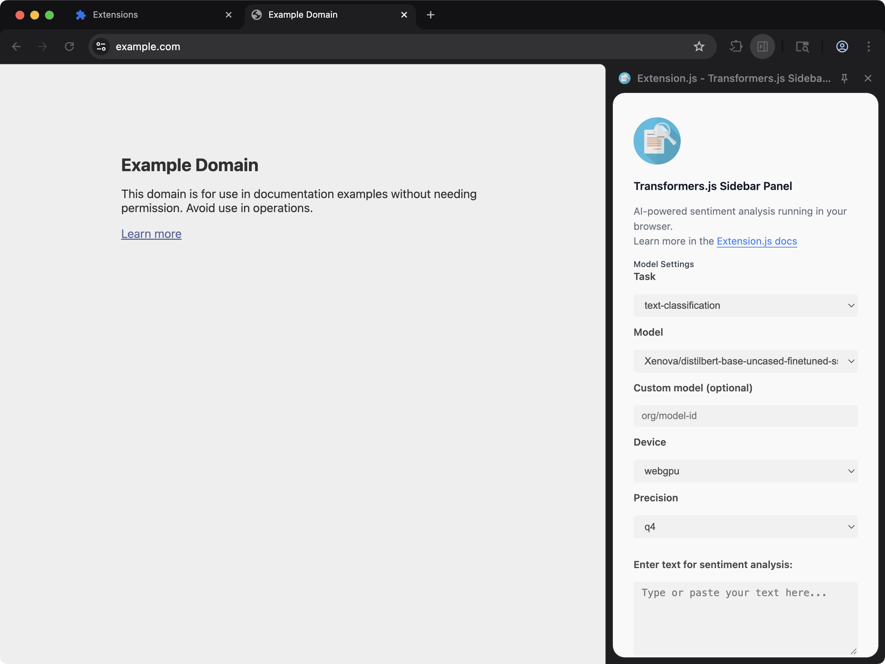

[powered-image]: https://img.shields.io/badge/Powered%20by-Extension.js-0971fe
[powered-url]: https://extension.js.org

![Powered by Extension.js][powered-image]

# Transformers.js Example

> Adds a sidebar panel that classifies the active page or your selected text with on-device AI models.



**What you'll see**: A small UI injected into any web page, isolated in a Shadow DOM so site styles don't bleed through.

**How it works**: A content script mounts a JavaScript UI inside a Shadow DOM and applies scoped styles so the host page can't bleed through. UI is composed with Transformers.js.

Sidebar + content script that runs [Transformers.js](https://huggingface.co/docs/transformers.js) pipelines on the active page or the current selection. No server, no API key: the model and tokenizer are loaded from the Hugging Face Hub on first run, and inference happens locally via WebGPU/WASM. A right-click context menu (`Classify selection with Transformers.js`) mirrors the in-sidebar flow for ad-hoc text on any page.

## Try it locally

```bash
npx extension@latest create my-transformers-js --template transformers-js
cd my-transformers-js
npm install
npm run dev
```

A fresh browser window opens with the extension already loaded.

## Project layout

```
src/
├── content/
│   └── scripts.js
├── images/
│   └── icon.png
├── sidebar/
│   ├── index.html
│   ├── sakura.css
│   ├── scripts.js
│   ├── SidebarApp.js
│   └── styles.css
├── background.js
├── constants.js
└── manifest.json
```

## Commands

Cloned this repo instead? The examples ship without npm scripts, so run Extension.js directly from the example directory. Run `npm install` first when the example declares dependencies.

### dev

Run the extension in development mode. Target a browser with `--browser`:

```bash
npx extension@latest dev .                  # Chromium (default)
npx extension@latest dev . --browser=chrome
npx extension@latest dev . --browser=edge
npx extension@latest dev . --browser=firefox
```

### build

Build for production:

```bash
npx extension@latest build .                # Chromium (default)
npx extension@latest build . --browser=firefox
npx extension@latest build . --browser=edge
```

### preview

Preview the production build with the bundled browser:

```bash
npx extension@latest preview .
```

## Tests

This template ships an end-to-end check (`template.spec.ts`) validated by the examples-repo CI on every commit.

## Learn more

- [Extension.js docs](https://extension.js.org)
- [Templates index](https://extension.js.org/docs/getting-started/templates)
- [GitHub: extension-js/extension.js](https://github.com/extension-js/extension.js)
